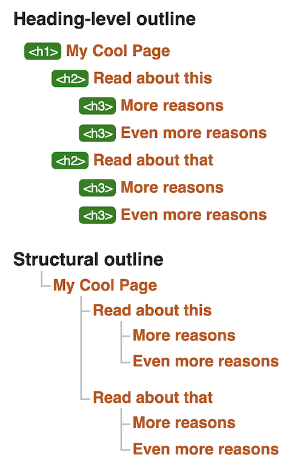

<section>

The goal of this post is to highlight a handful of useful HTML elements for improving a page's accessibility, and show that every developer can learn about and write accessible HTML!

You may be aware that ARIA roles are often used with HTML elements. I haven't written about them here, as it's good to see how HTML written without ARIA can still be accessible. I'll write a separate post describing the combination of HTML elements, ARIA, and landmarks.

An important thing to remember is that HTML is the semantic structure (like a skeleton) of a web page, and is not for styling. Elements such as `<strong>` and `<em>` do alter styles, but also have semantic meaning.

<h2 class="heading-margin">Contents</h2>
<ul>
<li><a href="#section-heading">Section Heading (h1-h6)</a></li>
<li><a href="#paragraph">Paragraph</a></li>
<li><a href="#lists-and-list-item">Ordered List, Unordered List, and List Item</a></li>
<li><a href="#description-list">Description List, Description Term, and Description Details</a></li>
<li><a href="#time-and-datetime">Time and datetime (attribute)</a></li>
</ul>

</section>

<section>

<div class="heading-with-siblings">
  <h2 id="section-heading">Section Heading (h1-h6)</h2>&nbsp;
  <a href="#section-heading" aria-hidden="true">#</a>
</div>

```markdown
<h1>My Cool Page</h1>

  <h2>Read about this</h2>
    <p>This is great because...</p>
      <h3>More reasons</h3>
        <p>About more reasons</p>
      <h3>Even more reasons</h3>
        <p>About even more reasons</p>

  <h2>Read about that</h2>
    <p>That is great because...</p>
      <h3>More reasons</h3>
        <p>About more reasons</p>
      <h3>Even more reasons</h3>
        <p>About even more reasons</p>
```

Section heading levels are an important part of a web page's HTML structure. They allow screen reader users to effectively "see" a web page as a tree of contents. This allows content to be navigated much more quickly and easily.

If section headings are skipped, e.g. a fourth level heading is used before a second level heading in the same section of the page, screen reader users can become confused when trying to work out the page's contents and structure. However, as shown in the above block of code there are third level headings followed by a second level heading. This is fine because section headings can be nested. Here, the third level headings act like subsections of the second level headings.

A great way to check the heading structure of a web page is by using the [W3C Validator](https://validator.w3.org/). First, add some HTML via URL, file upload or direct input. Then, open the 'More options' dropdown and select the 'Show outline' checkbox option. Then, click or tap the 'Check' button. Finally, select the 'outline' checkbox. Right at the bottom of the page should be the HTML's heading-level and structural outlines, similar to the following image:


<em class="image-caption">Heading-level and section-level outline output from <a href="https://validator.w3.org/">W3C Validator</a></em>

Another site for checking outlines with is the [HTML 5 Outliner](https://gsnedders.html5.org/outliner/)!

<div class="heading-with-siblings">
  <h2 id="paragraph">Paragraph</h2>&nbsp;
  <a href="#paragraph" aria-hidden="true">#</a>
</div>

```html
<p>Some content that you can skip.</p>
<p>Some content that was skipped to!</p>
```

Breaking content into paragraphs is another way to section content. Screen reader users can skip forward or backward between paragraphs, improving the navigability of a page. Using empty paragraphs for visual spacing or for any other styling consideration tends to hurt accessibility. This is because screen readers will announce even empty paragraphs, which can confuse users.

<div class="heading-with-siblings">
  <h2 id="lists-and-list-item">Ordered List, Unordered List, and List Item</h2>&nbsp;
  <a href="#lists-and-list-item" aria-hidden="true">#</a>
</div>

```markdown
<ol>
  <li>Item 1</li>
    <ul>
      <li>Do something with item 1.</li>
      <li>Do another thing with item 1.</li>
    </ul>
  <li>Item 2</li>
  <li>Item 3</li>
</ol>

<ul>
  <li>Unordered item</li>
  <li>Unordered item</li>
  <li>Unordered item</li>
</ul>
```

An ordered list (`ol`) can provide a numerical list and an unordered list (`ul`) can provide a bullet-point list. These elements are used to wrap list item (`li`) elements. Ordered and unordered lists can be nested within each other and will still be accessible.

Screen readers know to announce nested or unnested `ol` or `ul` elements as a list, and `li` as a list item. If an element other than `ol`, `ul`, or `li` is used to create a list, a screen reader will not recognise the list or any list items. In this case, ARIA roles can help. However, it's definitely best to use the correct, semantic HTML element wherever possible.

<div class="heading-with-siblings">
  <h2 id="description-list">Description List, Description Term, and Description Details</h2>&nbsp;
  <a href="#description-list" aria-hidden="true">#</a>
</div>

```html
<dl>
  <dt>Phone:</dt>
  <dd>0123 456 789</dd>
  <dt>Email:</dt>
  <dd>email@email.com</dd>
  <div>
    <dt>Hours:</dt>
    <dd>Monday to Friday 9am-5pm</dd>
  <div>
</dl>
```

Any key-value-paired information fits well inside a description list (orginially known as a definition list).

The three elements `dl`, `dt`, and `dd` are designed to be used together. In a description list, `dt` represents the key and `dd` gives the value of that key. For styling, adding microdata or other attributes, it is allowed (although some see this as a grey area) to wrap each key-value pair in a `div` element. You can use more than one `dt` element with a `dd` element.

A few screen readers such as VoiceOver for iOS will not announce these elements as lists (see [how description lists are treated differently](https://cdpn.io/aardrian/debug/NzGaKP)). Because of this, it's important to make sure each list item makes sense in the context of the other list items. Don't at all be put off that some screen readers do not announce these elements properly. Think of how many other screen reader users will still benefit.

<div class="heading-with-siblings">
  <h2 id="time-and-datetime">Time and Datetime (attribute)</h2>&nbsp;
  <a href="#time-and-datetime" aria-hidden="true">#</a>
</div>

```markdown
<p>
  We first opened our doors at <time datetime="2018-07-20T09:00:00Z">9am on 20th July 2018</time>
  for <time datetime="PT2H00M">2 hours</time>, as a trial.
</p>
```

The `time` element is used with the `datetime` attribute. This attribute's value can take formats such as:

- YYYY-MM-DDThh:mm:ssZ
- PTDHMS

See these used in the example code block above.

The datetime value can provide a standardised, machine-readable date or time that can be accessed by assistive technology. The human-readable date or time can be placed between the `time` element.

There are quite a few ways to provide a valid datetime value so I won't list them all here. However, there are available resources on the web for checking this. If a page uses JavaScript, then one great resource for creating dates is [date-fns](https://date-fns.org/). As with all JS libraries, it's really good to check that the HTML it outputs is accessible and semantic.

</section>
