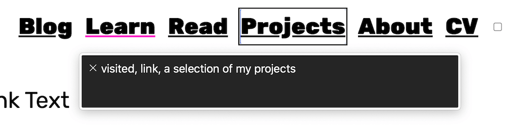

I use a bookmarklet tool called <a href="https://khan.github.io/tota11y/">tota11y</a>, which gives me a quick overview of my site's accessibility. On my site's homepage, the tool flagged not one, but SIX inaccessible links. Woops! There are over 20 links on the homepage of this site. The flagged links were the link to the homepage, GitHub, Twitter, LinkedIn, the learn page, and about page. 

The first four links simply had no text between the opening and closing `<a>` tags, only an image. For the GitHub, Twitter, and LinkedIn links, I didn't have to change anything. This is because they were represented by SVG images that already had a `<title>` element inside the SVG code. SVGs can have both `<title>` and `<description>` elements to aid accessibility. The homepage link read out the homepage URL, which wasn't ideal. So, I added a `title` attribute to this link with the value 'return to homepage'. This meant that instead of the homepage URL being read out, 'return to homepage' was read out instead.

I was a bit confused why the 'learn' and 'about' navigation links were flagged as inaccessible, so I checked the tota11y library. <a href="https://github.com/Khan/tota11y/blob/master/plugins/link-text/index.js#L34-L37">The words 'learn' and 'about' are listed as stop words</a>. I believe these words are singled out because they can be used alone or out of context. However, I believe that 'learn' and 'about' make sense in my navigation bar, so I ignored the warning.

If you decide a link with text between the `<a>` tags really needs to become more accessible, adding a `title` attribute value would not help. This is because screen readers will read out the text within the `<a>` tags, and only if there is no text there, will the `title` attribute value be read out.

There are a few ways to make a link with unclear text more accessible. One method is to add a `` next to the existing text that is hidden (<a href="https://hugogiraudel.com/2016/10/13/css-hide-and-seek/">this post describes a method for visually hiding text  using CSS</a>). This would make the text invisible in the UI, but able to be read out by a screen reader. Another similar, but easier, method is to add more descriptive (non-hidden) text to links, just as I have done for the link in this paragraph.

One more method is to use the `aria-label` attribute. The value of this attribute is read out by a screen reader even if the link already has text. For example, for my 'project' link, I could have added `aria-label="a selection of my projects"`.

<figure>
  
  <figcaption>
    A screenshot of the VoiceOver for Chrome screen reader announcing the aria-label of the 'projects' link
  </figcaption>
</figure>

<strong>Note 1 of 2:</strong> please <a href="/blog/aria-labels/">see this post on aria labels</a> for the important difference between `aria-label` and `aria-labelledby` (hint: `aria-label` values are not always easy for translation systems to access).

<strong>Note 2 of 2:</strong> try to use a variety of accessibility tools to audit your web pages. It isn't possible to catch all accessibility issues with one tool. It's also probably not possible to catch all issues with ten of them. Manual testing is highly recommended. This involves using a screen reader and keyboard to tab around your web pages.

## More resources

- https://webaim.org/techniques/hypertext/
- https://www.w3.org/WAI/WCAG21/Techniques/aria/ARIA8
- https://www.washington.edu/accessibility/links/
  

