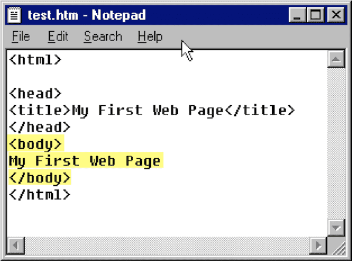

    <blockquote>
    
Yes, exactly!!!!
&mdash; Amber Wilson (@ambrwlsn90) <a href="https://twitter.com/ambrwlsn90/status/989514766807904256?ref_src=twsrc%5Etfw">April 26, 2018</a></blockquote>

Apart from code, what makes a good developer?

After a brilliant meeting with [Richard](https://twitter.com/richardbausek), the tech lead at my company, where we discussed my progress as a developer and what I could start aiming for, I came away with some (what I think are) really nice insights from our discussion. I want to share those here.

I think the advice here builds on my previous [post](https://amberwilson.co.uk/blog/beginner-programmer-advice/) from last month on beginner programmer advice. I am writing for everyone, but particularly for new developers, and particularly those developers who may feel a bit lost or hopeless due to the fast-moving pace of the web.

Ahem, so. Good developers. They write good code. Good code is their output, the end result of their work. It directly produces the stuff that people see. It’s tangible and visible, user experience depends upon it, and it’s what developers are paid to produce.

To be a good developer, it follows that the developer must write good code. Writing good code is hard. Much harder than I ever thought it would be. There are so many things to consider in the process. Many more things beyond producing something reminiscent to the picture below - i.e. the first sort of code I ever wrote and that allowed me an introduction to web development

Credit and big thanks to Frank Chimero for writing [this article](https://frankchimero.com/writing/everything-easy-is-hard-again/) and providing the above picture.

To be a good developer. This is something I am still learning. But it is fun. Challenging, too. I’m sure I’ll get to the tips in a minute. It feels good to muse for a while, though, don’t you agree? Right, let’s get to it.

First and foremost, a good developer **debugs**.

I did read somewhere recently that web development isn’t so much about creativity, as much as it is about fixing wonky code. That while web development is an attractive prospect for those who want to create beautiful and tangible user experiences, developers have to know they’ll mostly be spending a long time debugging in order to make broken code work again. I’ve begun getting in the swing of this by writing `console.log();` and `debugger;` into my (`JavaScript` - other languages have other methods) code. My developer tools are now always open, on a nice, big, separate screen to my browser, text-editor, CLI (other developers may prefer to use Git GUIs), and occasionally Redux dev tools. I am also learning where best to place my debuggers in my code, in order to get the desired result in my console. Something I’ve not done much yet, and I am still not so good at, is isolating code and placing it into either JS Bin or Codepen. Splitting code into smaller units, away from the other code it’s attached to. This is part of a good debugging process. Creating quick prototypes from parts of code where you have discovered a problem or bug. Apart from using `console.log();` or `debugger;`, developers can also try commenting out `include` files one by one, to see if the problem lies in code outside of the file being worked on.

Ok, breathe. That was a chunky paragraph. The second thing I think a good developer does is follow the **KISS principle**. My British sensibilities are delighted by saying outloud the long-form of this acronym - “Keep it simple, STUPID!”. Personally, one of the things that overwhelms me as a new developer, coming from a different career, and only having been exposed to table layouts before, is the “here’s a brand new way to do this one thing”™ that happens every few days. I have been lucky, though, to have been (and continue to be) guided by some great people who constantly and kindly remind me that I can relax. See Charlie Owen’s brilliant article [here](https://sonniesedge.co.uk/talks/dear-developer) for a deep dive into exactly what I mean. In short, web development doesn’t have to be as overwhelming it seems. Keeping things as simple as they need to be isn’t only something I hear from my friends who are developers. I hear it every day at work. It makes sense that developers build the most simple, MVP version of a feature they can, and then build on it later. This follows the principle of **YAGNI** (You Ain’t Gonna Need It). Building simple things makes sense because it stands to reason developers will lose a lot of time refining a feature, only to be told the refinements were unnecessary weeks later. I don’t know why I need constant reassurance that simplicity is best, but it is. Although to be honest, I am actually slowly getting better at believing it, and I can already tell I am producing better and faster code because of it.

Wow, that was an even chunkier paragraph. The third thing a good developer does is **good research**. I heard this one very, very early on in my web development career. Be a good researcher, aka, know how to Google an answer to a problem or issue. This is an art to be refined over time, as a developer discovers new nooks and crannies of the web that they never knew existed before. Some places are excellent sources of knowledge. I’ve gotten into the habit (does anyone else do this?) of bookmarking nearly every web page I visit that helps me find the answer to a development question. Knowing what words to use in the search bar is very important. It’s quite similar to academic research (something I had to get good at as a psychology student). Searching using the right language helps you find the right material. This gets harder when people use different terms for the same thing, or like to make up their own terms for things that already have names. Another tip is to check the source code of web sites and apps that do the kinds of things you want to do, and learn how those developers did those things. This is of course more difficult these days with the increasing tendency of developers to generate dynamic HTML using JavaScript (something else Frank Chimero talks about in his article). Anyway, to close this paragraph so it doesn’t beat the length of the second paragraph, I’ll leave you with a question. When should you reach out to other developers for help?

Following from the question at the end of the last paragraph, I’ll finish by saying that good developers should **learn to work well with others**. What does “well” mean? It depends on your team or the developers, designers, managers, and whoever else you have regular contact with. People in a team tend to be busy, and most of them appreciate being left alone to focus in order to get work done. I have found this to be especially true of developers. In my three months working on a team on a complex project in Berlin, communication has been extensively discussed, as much within retrospectives as out of them. Being a developer is hard, writing good code is hard. Developers have to keep in mind not only the three points from the previous three paragraphs (please recap those, they are important), but also often have to keep complex file trees in mind while desperately trying to focus. As well as this, developers need to think of the quality of their code, whether it is accessible, how performant it is, whether stylelint will accept it, how to alter config to allow a certain piece of code or new feature to work, etc. Regular discussion with other developers around good communication and respecting their space has worked wonders in my team. We are very happy to be working with each other. In the past weeks, I have been pinging other developers over Slack, rather than addressing them directly (this was an actionable item from a retrospective). I often catch developers over lunch, when they are away from their work and tend to be more relaxed. Here, I usually ask them how I could best approach them with issues, ranging from code structure to deployment methods, to CLI issues. Alright, maybe short paragraphs aren’t my thing.

Short extra tip that I just thought of - a good developer **finds good developer tools**. I won’t get deeper into this, but I think it’s important to mention. Having a good set of developer tools and utilising the shortcuts in these tools can improve a developer’s development experience. I am quite in awe of the workflow of more senior developers I work with. In a nearly indiscernible flurry of keys, some of these developers achieve the same series of events/outcomes that can take me twice or three times as long. While I do like the more manual way of doing things, I am slowly but surely coming round to using a set of tools (usually tools that are open source and maintained by hard-working developers in their free time) that shave more and more seconds of my development time and cause me to feel less stress. Oh and one other thing, good developers write good **tests**. I feel like writing a separate post on testing as this is a big part of being a developer (that I certainly wasn’t aware of when starting out).

TL;DR

Apart from writing good code (well, in order to actually write good code), a good developer:

*   debugs
*   follows the KISS principle (and respects YAGNI)
*   knows how to research
*   works well with others
*   finds good developer tools
*   tests code

Many other developers have written extensively about all of the above points. One nice article I found is [this one](https://24ways.org/2017/levelling-up-for-junior-developers/) by Dean Hume.

Please let me know what you think of these tips. If you agree or disagree, I’d love to hear. I hope you can help me learn to be a better developer :)