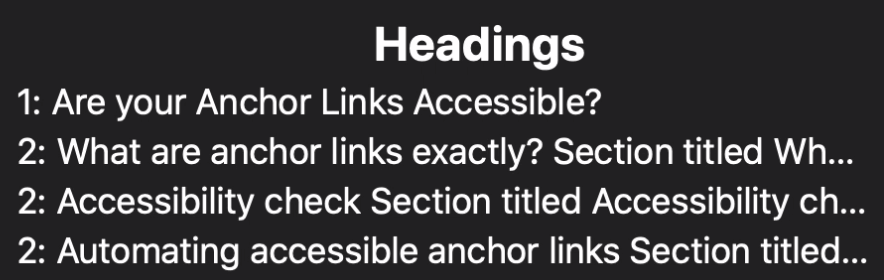
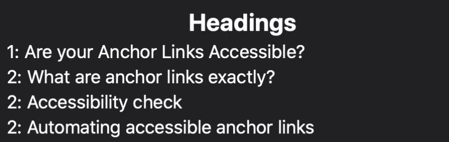

One day I decided I wanted to add anchor links to each of the sections in my blog posts. Over the past few months, I'd seen these links on a lot of pages—from official documentation pages to smaller blog posts. I find them really useful for sharing sections of pages with other people!

To make the different sections of my blog posts shareable, I decided to add an anchor link to all of the section headers (`<h2>`s) in each of my posts.

While researching the best way to do this, something I noticed again and again was that other sites had almost always implemented anchor links in an inaccessible way.

Within a few hours, I had made a plugin to automate the addition of anchor links to my blog post sections, AND I had ensured the links were accessible!

## Contents

- [What are anchor links exactly?](#what-are-anchor-links-exactly%3F)
- [Accessibility check](#accessibility-check)
- [A word of caution](#a-word-of-caution)
- [Another option](#another-option)
- [Automating accessible anchor links](#automating-accessible-anchor-links)
- [Continued discussion](#continued-discussion)

## What are anchor links exactly?

Anchor links provide a way to link to separate sections of a page. On this page, hover over the level two headings on desktop to see the links (the links are always visible on smaller screens).

In essence, an anchor link is a link containg a URL fragment. This fragment usually appears at the end of a URL. It begins with a hash character (`#`), and is followed by a string. This string identifies a section in a web page. 

For example, a page may have a section containing a section header element such as an `<h2>`. This element can be given an `id` attribute. An anchor link is created when the value of the `id` matches the `href` value of an anchor (`<a>`) element on the same page. Consider the following code:

```html
<h2 id="introduction">Introduction</h2>
<a href="#introduction">#</a>
```

Imagine the web page containing this code had the following URL: `https://example.com/blog/nice-post/`. Clicking on the hash character within the `<a>` element would do two things; the browser window would scroll to the beginning of the introduction section, and the URL would become `https://example.com/blog/nice-post/#introduction`. This URL can be shared and when opened in a browser, the page will automatically scroll to the introduction section.

## Accessibility check

Of course, I wanted to make sure the anchor links I had written were accessible. I turned on VoiceOver (a screen reader for MacOS), and using caps lock with arrow keys to interact with the page's content, I moved to my section heading. I found a few issues. Below is the **first** version of my anchor link:

```html
<h2 id="introduction"><a href="#introduction">#</a>Introduction</h2>
```

When the `<a>` element is inside the `<h2>`, VoiceOver reads out "heading level 2 2 items, visited, link number introduction". A screen reader user who wanted to skip across multiple headings at once would have a nicer experience if they only heard the actual heading text (i.e. "introduction").

I realised the `<a>` element should exist as a sibling of the heading element, rather than a child of it. This is so that the `<h2>` text content remains clear. Below is the **second** version of my anchor link:

```html
<a href="#introduction">#</a>
<h2 id="introduction">Introduction</h2>
```

When the `<a>` element is outside the `<h2>`, VoiceOver reads out "link number" for the `<a>` and "heading level two introduction" for the `<h2>`. This is a problem, as the elements are not associated with each other in any way.

Associating anchor links with what they link to is important. Some anchor links I found on a popular site have SVGs with no labels or titles as content. When there is no information about a link available, the screen reader falls back to the href value (e.g. `https://example.com/blog/nice-post/`). This makes the purpose of the link hard to decipher. 

I realised I needed to better associate my section headings with their anchor links. Below is the **third** version of my anchor link:

```html
<a aria-label="link to this heading" aria-describedby="introduction" href="#introduction">#</a>
<h2 id="introduction">Introduction</h2>
```

The attributes I added are `aria-label` and `aria-describedby`. 

The `aria label` is read out by a screen reader in place of whatever child the `<a>` element has. This is necessary for anchor links, as these links often have a single character as text content. One alternative is to describe the link using text content, but visually hide it (hint: I removed this attribute in a later version of my anchor link - refer to the fifth version).

The `aria describedby` matches the `id` of the `<h2>`. When the link is focused, "link, link to this heading" is read out, followed by "introduction". This is much better, but there could be one more small improvement—having the heading before the link (hint: I removed this attribute in a later version of my anchor link - refer to the fifth version).

I realised that my anchor links would make more sense if the heading came before the link. Below is the **fourth** version of my anchor link:

```html
<h2 id="introduction">Introduction</h2>
<a aria-label="link to this heading" aria-describedby="introduction" href="#introduction">#</a>
```

VoiceOver reads the `<h2>` out as "heading level 2 introduction" and the `<a>` as, "link, link to this heading, introduction". When the heading is first, screen reader users may be able to associate a section heading more easily with its corresponding anchor link.

While I made great progress by the fourth version of my anchor link, there are final some outstanding issues that I wanted to address. Thanks to my friend <a href="https://kittygiraudel.com/">Kitty</a> for helping me realise these outstanding issues. Be sure to keep up to date with Kitty's current <a href="https://kittygiraudel.com/2020/12/01/a11y-advent-calendar/">A11y Advent Calendar</a> and check out their other great posts. <span role="img" aria-hidden="true">&#128578;</span>

First, `aria-label` is not actually brilliant for accessibility, as some translation services can have trouble accessing its value. So, it's best to add text content to the `<a>` element, and make sure to visually hide it. This way, screen readers can still access it but it'll be visually hidden for other users. Second, the `#` can be left in and hidden from screen readers using `aria-hidden`, while still being visible on the page.

Lastly, I removed `aria-describedby` because the anchor link's text content now references the section heading.

Here is the **fifth** version of my anchor link:

```html
<h2 id="introduction">Introduction</h2>
<a href="#introduction">
  <span aria-hidden="true">#</span>
  <span class="hidden">Section titled introduction</span>
</a>
```

This fifth and final version of my anchor link is the one I am using on this page, along with a wrapper `<div>` for styling purposes. It is much better than the first version! However, if you can think of improvements, please let me know.

## A word of caution

**Edit (17th December):** Beware, there be dragons! <span aria-hidden="true">🐉</span> I realise that including a link (that has its own text content) as a child of a heading may seem tempting (as it can make styling an anchor link easier). However, it's worth repeating that this can harm accessibility.

Version one of my example anchor link (see <a href="/blog/are-your-anchor-links-accessible/#accessibility-check">accessibility check</a>) introduces the issues caused by placing a link inside a heading, but I want to provide some more context to why it is not a good idea! I'll do this by describing a handy feature of VoiceOver.

VoiceOver (and likely also other screen readers) gives a nice overview of a page's section headings. This feature, called the web rotor, is accessed by default by pressing `caps lock` + `u` while VoiceOver is on. Below are two screenshots of the web rotor comparing how headings are formed, depending on whether a link is inside or not:

<figure>
  
  <figcaption>VoiceOver web rotor displaying headings containing links</figcaption>
</figure>

<figure>
  
  <figcaption>VoiceOver web rotor displaying headings without links</figcaption>
</figure>

If a link that has its own content is placed within a heading, the computed heading text may be more difficult for a screen reader user to understand. This can affect how clear a page's structure is.

## Another option

**Edit (18th December):** Despite warning against the following option above, I want to write about making a whole heading into an anchor link. Or, more specifically, wrapping the heading text content in a link. Several people across different sites have asked me why I didn't mention this option before:

<blockquote class="twitter-tweet"><p lang="en" dir="ltr">Interesting reading but why do you need the # symbol in the HTML at all?<br><br>Why not just make the whole heading the link (easier clicked too!) and use ::before or ::after to put the symbol there through CSS? <a href="https://t.co/ecaDkZjJH0">https://t.co/ecaDkZjJH0</a></p>&mdash; Barry Pollard (@tunetheweb) <a href="https://twitter.com/tunetheweb/status/1338984100133294083?ref_src=twsrc%5Etfw">December 15, 2020</a></blockquote>

I think both options—using an icon as a link, and making the header a link (when the content of the link is the heading text)—can be valid. However, I have a few concerns with wrapping a heading's text content in a link: 

- It can be useful separate the anchor link from the heading so that the link can have its own text content
- It may be harder to select heading text wrapped in a link
- Both screen reader and non-screen reader users may find this option less familiar and not understand its purpose

Here are two examples of sites that implement anchor links where a link wraps the text content of a heading: <a href="https://developer.mozilla.org/en-US/docs/Web/HTML/Element/link#Including_a_stylesheet">MDN Web Docs</a> and <a href="https://almanac.httparchive.org/en/2019/accessibility#introduction">The Web Almanac</a>.

Here is a code example of an accessible anchor link where a link wraps the text content of a heading:

```html
<h2 id="introduction">
  <a href="#introduction">
    Introduction
  </a>
</h2>
```

Would you rather implement anchor links in this way? It is a simpler solution. However, it is also less flexible.

Of course, the way a feature is implemented depends on your own personal use case. But, no matter which way you implement something, please remember to think of the user experience!
## Automating accessible anchor links

I use <a href="https://www.11ty.dev">Eleventy</a> together with <a href="https://github.com/markdown-it">markdown-it</a> to convert my markdown files into HTML files.

I tried finding a plugin that would help me to automate the addition of anchor links for all my `<h2>` elements. I did find one but soon realised it didn't make accessible links possible. So, I decided to make my own plugin.

There is handy <a href="https://github.com/markdown-it/markdown-it/tree/master/docs">markdown-it developer documentation</a> for people wanting to create plugins. Using these docs, a <a href="https://markdown-it.github.io/">markdown-it demo page</a>, and some inspiration from a plugin called <a href="https://github.com/valeriangalliat/markdown-it-anchor">markdown-it-anchor</a>, I wrote a plugin.

Here is <a href="https://github.com/ambrwlsn/website/blob/da2056c316fa45fa58b443b07be1ac4c5080912e/helpers/markdown-anchor-wat.js#L1">a permalink to my plugin file</a>. It recreates parsing functions for opening and closing `<h2>` elements from the `markdown-it` library. In my `eleventy.config` file, I `use` (connect) the plugin with `markdown-it`. This allows me to automatically add custom anchor links for all my level two headings.

## Continued discussion

A few people have been inspired by this post and one of them is [Nicolas Hoizey](https://nicolas-hoizey.com/). In February 2021, Nicolas created [an issue in markdown-it-anchor's GitHub repository](https://github.com/valeriangalliat/markdown-it-anchor/issues/82), hoping the maintainers would consider making changes. 

What followed was a really good discussion among several people, kicked off by [Valérian Galliat](https://www.codejam.info/val.html), regarding the solution I decided on in this blog post. I definitely recommend reading through the comments because there are some great nuggets of information about accessibility in there!

Here are some criticisms of the approach to accessible anchor links that I took in this blog post: 

- The text hidden with CSS creates a large gap between heading and paragraphs in Firefox reader mode. However, this could be seen as a reader mode limitation.
- There is an SEO concern that text usually hidden with CSS shows up in descriptions of posts in Google. However, anchor links will most likely not being reported as illegitimate content.
- Text usually hidden with CSS also shows up in RSS readers.

Some suggested that `aria-label` could be used to offer accessible text without the need for `aria-labelledby`.  [Kitty](https://kittygiraudel.com/) reminded us that [`aria-label` is notoriously bad with content translating services](https://heydonworks.com/article/aria-label-is-a-xenophobe/) such as Google Translate.

I learned a lot from the discussion. I still think there is not really a **silver bullet** to creating accessible anchor links that would suit everyone. There are quite a few ways to approach it, each with their own advantages and disadvantages, based on things like browser support, screen size, screen readers, and more. 

However, [Barry Pollard](https://www.tunetheweb.com/) made a good point. His idea is that there are [several advantages to making headings into links themselves](https://github.com/valeriangalliat/markdown-it-anchor/issues/82#issuecomment-788268457). I would be happy to use this approach on my own site. Try to hover or focus [a heading on a Web Almanac post](https://almanac.httparchive.org/en/2020/accessibility#ease-of-reading) to see the approach first hand.


What do you think? I'd love to know if you have any ideas. If so, please comment on the [GitHub Issue](https://github.com/valeriangalliat/markdown-it-anchor/issues/82)!


