I am starting this post almost 4 months too late, but I want it here so I can be kept (at least a little) accountable for starting (and finishing!) as many books as I can.

Most of the books I read are recommended by friends. Any others will either be completely random or based on my interest in science, design, psychology or philisophy. Some will be about things that I really think I should know more about, like politics.

Here are the books I have read so far:

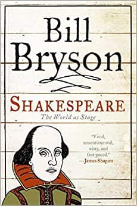

Shakespeare - Bill Bryson

A really cool insight into just how hard people have tried to gather reputable, solid evidence about Shakespeare's life and who he actually was. Throughout, it becomes ever clearer that the truth is likely forever lost. I loved the picture that's painted of Shakespearean London, and the antics of other prominent figures from the time period.

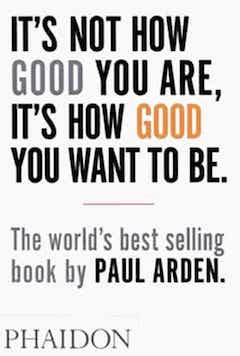

It's Not How Good You Are, It's How Good You Want To Be - Paul Arden

Rollercoaster of good ideas that were learned from a career in advertising. Stuffed full of tasty advice on how to be creatively brilliant. Insights into the minds of clients and what they really want. And that they don't want what you think they probably want. We may all hate adverts, but really we are all selling something. "We are all in advertising. It's a part of life."

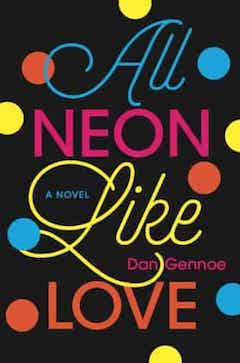

All Neon Like Love - Dan Gennoe

First novel I've read in a long time, and I'm proud that I did! This story is a psychological, often dark, and always thorough, look into the mind of a man obsessing over a women he thinks he knows. We hear plenty about his sadness, his thoughts, his anxieties and concerns. Bit hard to get through at times, but I think it's worth it. I like how it made me feel a range of emotions, made me empathise with the characters, and painted vivid pictures using great descriptive language. Think those are signs of a good book.

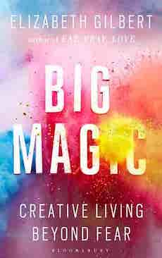

Big Magic: Creative Living Beyond Fear - Elizabeth Gilbert

Where can I start with this book. I've never highlighted a book so many times, never read something and thought "yes, I do that" or "that's me!" so many times. This book contains messages that I will never forget. Messages that people are probably generally aware of, but that get buried under fear, anxiety, lack of confidence, doubt etc. It's a rare thing for me to read something and feel so confident that it has changed my life for the better. But this one has. The wise, funny and completely relatable Liz Gilbert has an honest, no-bullshit conversation with you. A conversation that feels like it's over coffee and she's known you for years. Thank goodness for people like her.

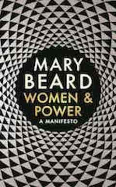

Women and Power: A Manifesto by Mary Beard

A short and thought-provoking book. Mary Beard deconstructs some of the history behind the lack of women in power today. She uses clever and interesting analogies and brings together pieces of information that I am sure people who aren't looking might miss. I wish it would have been longer. Definitely a good read for anybody curious about the balance of power between men and women in various positions.

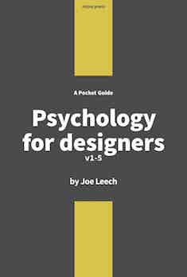

Psychology for Designers by Joe Leech

A sweet and short introduction to psychology and design. Joe tells us his story, his experience with academic psychology and human computer interaction. He provides many examples and resources. Reminded me a lot of my own academic studies in psychology. My favourite part was at the end of the book in 'Extras' where he talks about myths and key findings in those areas of psychology that are most important to design. I particularly like the idea of mental models. A really nice little book. There are some spelling and grammar mistakes but I'm personally nitpicky about that stuff.

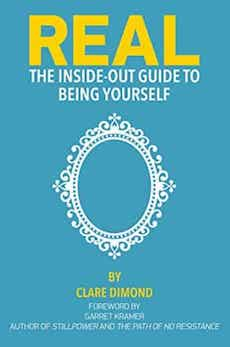

Real - The Inside-out Guide to Being Yourself by Clare Dimond

At risk of sounding cliché... where has this book been all my life? I've never read such a pure, real or beautiful book. I repeat the words inside it to myself daily... "There is only the moment, we are merely an idea of a self, thoughts rushing through us like waves. We only exist in the prescence of another. We need nothing, we are already all we'll ever need". Another life-changing book for me. Absolutely and completely.

A Man with One of Those Faces by Caimh McDonnell

I'm not one to usually go for crime novels, but the prologue made me laugh so I gave it a go. A great thing about this book is that it's set in Ireland and that the author has portrayed everyone's accents and personalities perfectly. The characters are great. I love the way the story twists and turns and is really not that predictable at all. Looking forward to reading the next three books in the series!

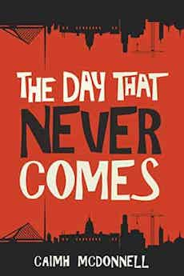

The Day That Never Comes by Caimh McDonnell

Just as funny and surprising as the prequel!

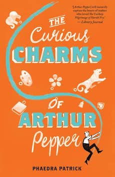

The Curious Charms of Arthur Pepper by Phaedra Patrick

A lovely book that had lots of English-y things for me to identify with. It is very centered around communication between family members and about the struggles normal people face. There were lots of moments that had me nodding my head and feeling emotional - especially where Arthur was reflecting about his life. Really glad I picked this little gem up.

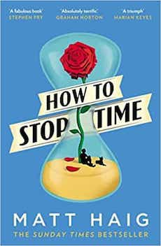

How To Stop Time by Matt Haig

Saw a friend reading this on Sunday afternoon, July 8th and by Tuesday evening, July 10th I had finished it. Beautifully and poignantly written. I could barely put it down and couldn't wait to pick it up again. I got lost in the fascination of a person's experience through time. Great messages in the book as well. I am sure anyone would enjoy many of the quotes in there. I loved it, loved it, loved it. _Even_ if it rather often reminded me of a movie script.

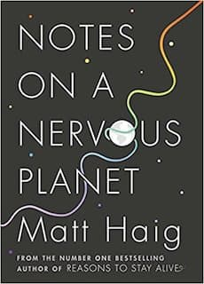

Notes On A Nervous Planet by Matt Haig

I had high expectations of this book, because the last book I read by Matt was so good. Unforunately I didn't like this one as much. The subject matter is great, but it felt as if the book was rushed and could have used a much more coherent structure. That's not to say I didn't get anything out of it - I did. I love any honest portrayal of mental health issues and ways to move forward. The content could have been organised a lot better. I sped-read the last 50 pages.

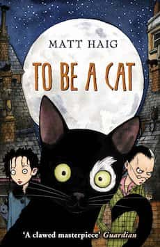

To Be A Cat by Matt Haig

I bought this third book by Matt Haig after reading glowing reviews. I knew beforehand it is meant as a kids book (although I am really unsure what age) but that it was okay for adults, too. I am unsure of the age because some parts are a bit more graphically described than they need to be and I didn't like that the main character has freckles and this is made out to be a bad thing (?!). Skipped over a few pages. There is a nice message hidden there somewhere about how it's important to be yourself and like who you are, but some of the ideas and writing style I didn't like much at all.

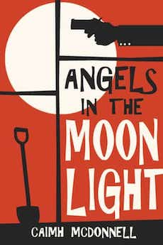

Angels in the Moonlight by Caimh McDonnell

Didn't realise this was the prequel to all three of Caimh McDonnell's Dublin crime trilogy books. I loved how there was so much Bunny in it, and you've got to read it to know what I mean. Very interesting characters, with even more interesting stories and ideas. There were parts that had my eyes glued to the page. There were parts that made me laugh my head off (metaphorically, not literally). This book, like its relatives, are so clever. The language and humour is a total delight. Super duper happy I stumbled across this series.

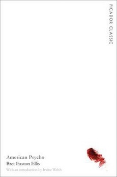

American Psycho by Bret Easton Ellis

I didn't really get it. I think the message is supposed to be that we shouldn't be too materialistic, and some people are psychopaths. Was difficult to finish because nothing about it really hooked me in.

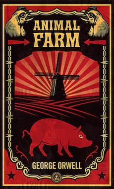

Animal Farm by George Orwell

Tried reading this as a child but couldn't get into it. I was glad to be able to enjoy it this time. It's fascinating for a few reasons. First is the writing style, which is understandably old-fashioned as the book was written in the 1940s. Second is how it reminded me of how society is fed lies to keep everybody calm and placated, most often for the benefit of the few. Third is the real-life events the story was based on. I only glanced at the Wikipedia article so far, but I recommend giving it and the book a read if you're interested.

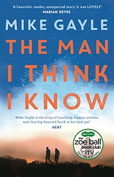

The Man I Think I Know by Mike Gayle

Got this because of glowing reviews saying what a feel-good novel it is. It started out alright, because the format of the unlikely friendship seems unique. The entire book lacked any sort of depth for me, though. It's written in such a pallid, bland and sickeningly oversimplified way. I rolled my eyes at least a few times throughout. I don't understand how people could be crying and so deeply touched by it. Each to their own.

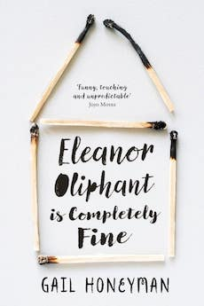

Eleanor Oliphant is Completely Fine by Gail Honeyman

A friend recommended this book via an Instagram story. She said that the story gets into the main character's head and deals with all the emotions. This is true. I found the book hard to get into at the beginning, but the last half is better. Some characters I liked, some I wasn't so sure about. There have been some people that bash the book's attempt to highlight the effects of trauma and I can understand the criticism, but it still gets some good points across in my opinion. Would be interested in the same sort of story where the main character experienced more subtle sorts of abuse than the main character in this book, since I believe many thousands of people suffer much more hidden sorts of abuse.