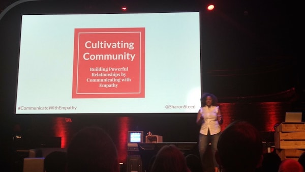
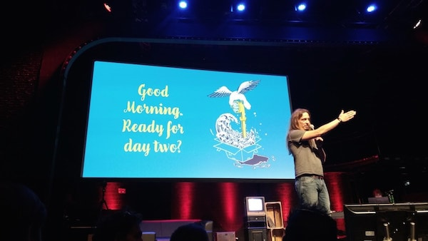
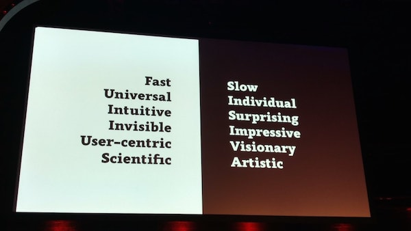
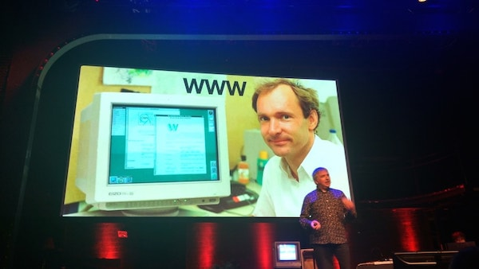
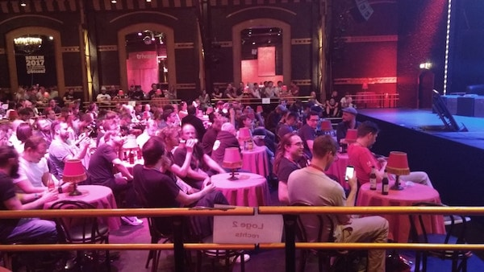
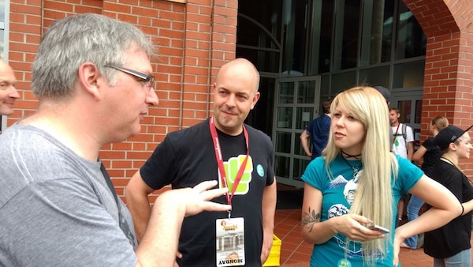
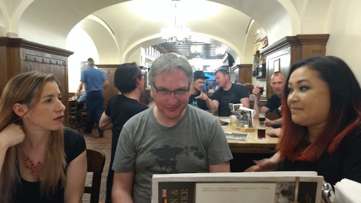
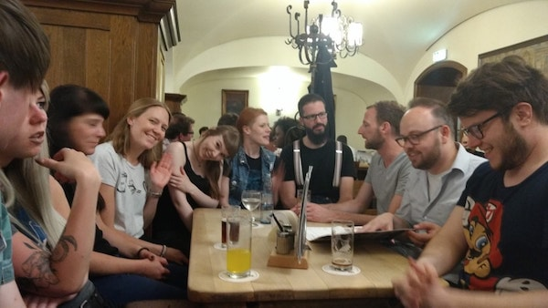
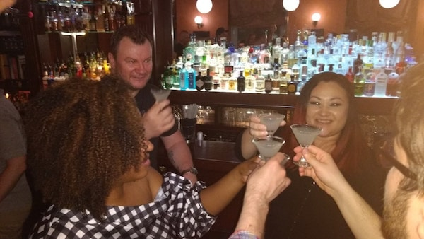

 
 
 
 
 
 
 
 

What can I say? My first conference experience. Many thanks to those who made it possible - especially [Joschi Kuphal](https://jkphl.is/). It was such a whirlwind of knowledge, meeting new people and enjoying good food & beer. All the while enjoying the unxepected but intense sunshine that had appeared after weeks of cold and rain in Germany. I am keen to return again and again, most of all to reunite with the kind, funny and extremely interesting people I was so lucky to meet there.
