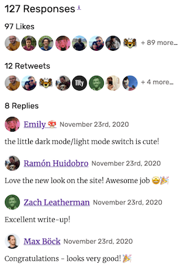

When I re-made my site with Eleventy, the pages didn't change much, but I had loads of fun adding new features. The most fun was **webmentions** and I'm here to convince you to add them!

First, let me step back and explain why webmentions exist—the IndieWeb.

    <h2 id="indieweb">
        IndieWeb
    </h2>
    

Check out this official description of the IndieWeb:

> The IndieWeb is a community of individual personal websites, connected by simple standards, based on the principles of owning your domain, using it as your primary identity, to publish on your own site (optionally syndicate elsewhere), and own your data—**indieweb.org**</a>

So, a community of personal websites, connected together, used as identities, that makes ownership of data possible. &#129412; &#127752; How does this all work?

- There's a <a href="https://indieweb.org/">great IndieWeb resource</a>  that will tell you everything you need to know
- But, start here if you want to know <a href="https://indieweb.org/why">why the IndieWeb deserves your attention</a>
- When you're convinced, see this handy page for a <a href="https://indiewebify.me/"> quick start to becoming a citizen of the IndieWeb</a>
- International IndieWebCamps are here to help—I wrote a <a href="/blog/indiewebcamp/">post about my first IndieWebCamp visit</a><figure><figcaption>Nürnberg IndieWebCamp 2017 (I'm in the bottom right)</figcaption></figure>

    <h2 id="webmentions">
        Webmentions
    </h2>
    

Now the juicy stuff!

I think the coolest thing about the IndieWeb is that it is decentralised. Currently, there is a handful of corporations that own much of our data. With webmentions, each person owns their own data and each person can communicate with others. Webmentions are basically a way to display on your personal site ways that others have interacted with your content.

On my site I display mentions and bookmarks. It's possible for someone to link to one of my blog posts within one of their blog posts or bookmarks. If they do this, I won't know about it unless they let me know about it. <a href="https://webmention.app/">Letting others know you've mentioned their posts can be done manually or can be automated</a>.

I also display likes, retweets and replies on blog posts that I have tweeted about. If the URL to my post is in my tweet, I can gather the interactions on that tweet and display them on that post. Although most social media platforms do not support webmentions, it's possible to gather them by using a great free service called <a href="https://brid.gy/">Bridgy</a>.

Some people have had webmentions on their site for many years, so I am a bit behind. <a href="https://adactio.com/journal/6495">Jeremy has had webmentions since 2013</a>. But, there are more people posting content online than ever before, and personal websites aren't shown the love they used to get.

So, there has never been a more pressing need to put content creation platforms (e.g. Medium) and social media platforms (e.g. Twitter) second, and put your very own little corner of the web first &#128150;

I used Max Böck's post on <a href="https://mxb.dev/blog/using-webmentions-on-static-sites/">using webmentions in Eleventy</a> to get started. I was able to get something on the screen quickly with Max's advice, and then I refined the incoming data a bit. Here is a summary of what I did:

- Sign up via <a href="https://webmention.io/">Webmention.io</a> - if this doesn't work right away, check out ways to <a href="https://indielogin.com/setup">set up your website for indie logins</a> (I'm able to sign in by linking to my GitHub account on my site's homepage)
- Add two `<link>` tags to your HTML document's `<head>` element: `<link rel="pingback" href="https://webmention.io/{your-domain-here}/xmlrpc">` and `<link rel="webmention" href="https://webmention.io/{your-domain-here}/webmention">`
- For social media mentions, sign up to <a href="https://brid.gy/">Bridgy</a>
- Fetch <strong>all</strong> of your site's webmention data in JSON format using one of the <a href="https://github.com/aaronpk/webmention.io#api">webmention endpoints described by IndieWebCamp co-founder Aaron Parecki</a> and the API token provided by <a href="https://webmention.io/">Webmention.io</a>
- Shape your webmention data however you like - I filter webmentions into separate re-tweet, reply, like, mention, and bookmark functions using the `'wm-property'` (check out the <a href="https://github.com/ambrwlsn/website/blob/1d713ad9fbce19a9bd8821790fd51c1be62e1f76/src/filters/webmentions-filter.js#L51">filter functions</a> and before you say anything, yes I know they could be DRYer)
- Use the data to display webmentions on your blog posts

Here are some of my webmentions (from <a href="/blog/from-gatsby-to-eleventy/">my Gatsby to Eleventy post</a>):

If all of this seems too difficult and inaccessible, please don't give up! I thought getting webmentions on my little static site would be <strong>way too difficult</strong>. But there are so many wonderful posts about setting up webmentions, and so many great people willing to help. I count myself as one of those people :) If you want to implement webmentions on your site and are stuck on any of the points I listed above, ping me on Twitter and I'll do my best to help out.

