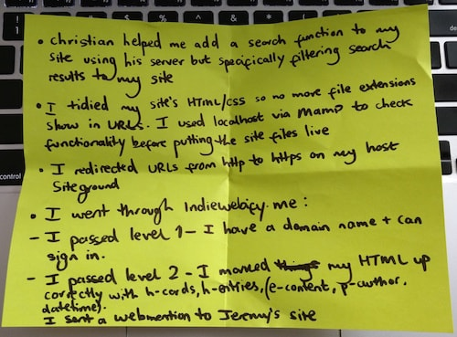
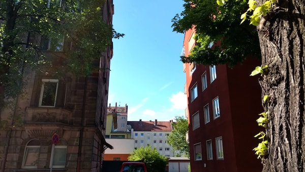
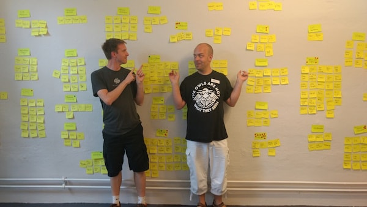
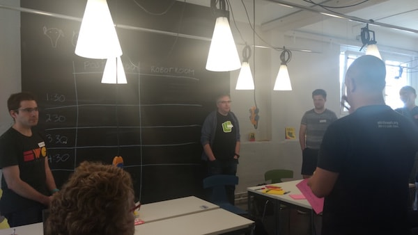
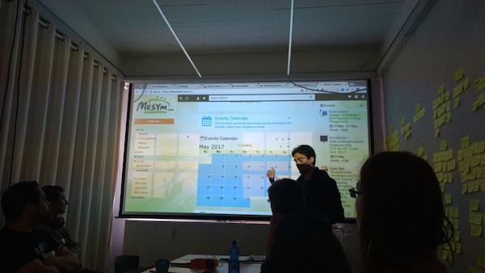
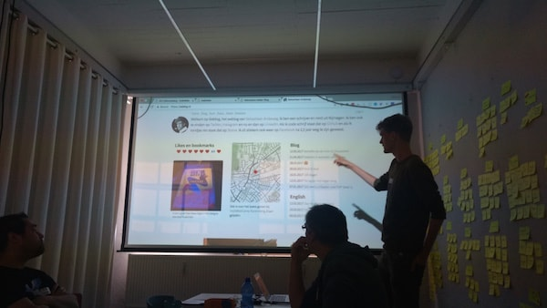
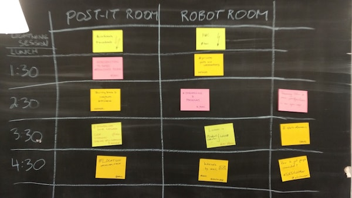
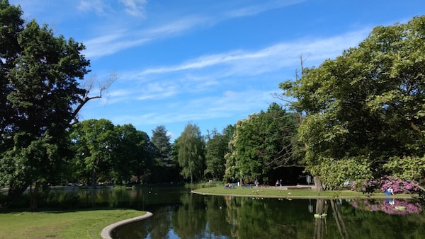
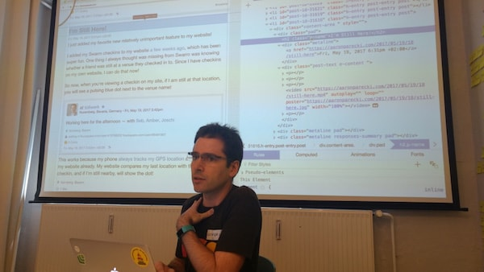
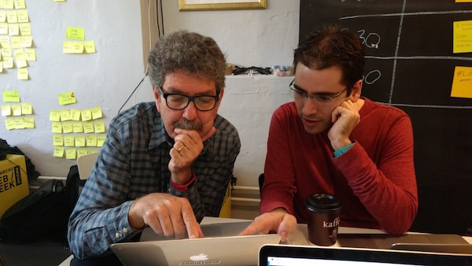

My experience of [IndieWebCamp Nürnberg](https://indieweb.org/2017/Nuremberg) (check out the GIF at the end!) was complemented by [Beyond Tellerrand Düsseldorf](https://beyondtellerrand.com/events/duesseldorf-2017/speakers) and the [Evaluating Technology](https://calumryan.com/learning/evaluating-technology/) workshop by [Jeremy Keith](https://adactio.com).

It was my first time attending any of these events and each brought its own unique [experience](../btconf/).

The IndieWebCamp was split into two parts. On Saturday we gained inspiration from discussing different topics suggested by camp attendees. On Sunday we harnessed this inspiration and, alone or in groups, we got to work.

Through the continuous but pleasant hum of tapping keys and some select songs from a German radio station, we spent many focused hours working. The scope of the work varied quite a lot. A few of us were fairly new to the Web scene (me included), and we worked on making a number of small improvements to our sites. Some more seasoned Web developers had more specific projects in mind, from working with Grav and Jekyll (CMS), to tinkering with [Webmention](https://indieweb.org/Webmention) formats, to improving back-end systems using Node.js. Others were working on things like personas or information sites that will help encourage more people to learn about the [IndieWeb](https://indieweb.org/). One attendee worked on a four-year old project involving creating decentralised social networking sites, with the ultimate goal being getting rid of Facebook.

We all demoed what we'd done - check these out [here](https://youtu.be/_Zub-PBHPng) :)

Personally, I worked on HTTPS, site search, file extensions, HTML/CSS tidying, redirects, and passing IndieWeb levels one and two via [indiewebify.me](https://indiewebify.me/).

Thanks to [Joschi](https://jkphl.is/) for this [shoutout](https://twitter.com/jkphl/status/866310997207863296).

Some of my takeaways from the camp were:

*   I might not yet understand how to use the hugely varied technologies that contribute to forming the Web, but that's okay. I can and should keep asking, doing and learning.
*   The developers at the camp were so friendly and encouraging, just like the developers I've met in Brighton. I've achieved so much with their help and am so happy to belong to a community of such nice people.
*   There is a point to decentralising the Web and I'm really glad to be part of the effort towards achieving this.
*   The idea of [POSSE](https://indieweb.org/POSSE)ing (publishing on your own site, syndicating elsewhere) is very powerful and helps keep the Web independent as well as allowing you to own your own content.

Thanks to [Joschi](https://jkphl.is/) for inviting me and making my stay really comfortable. Thanks to [Aaron](https://aaronparecki.com/) for helping the camp run so smoothly alongside Joschi and Jeremy. And thanks to [Jeremy](https://adactio.com) for helping me with Web stuff.

Looking forward to future IndieWebCamps - hopefully the next one will be in Brighton in September!

         

