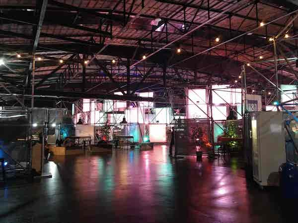
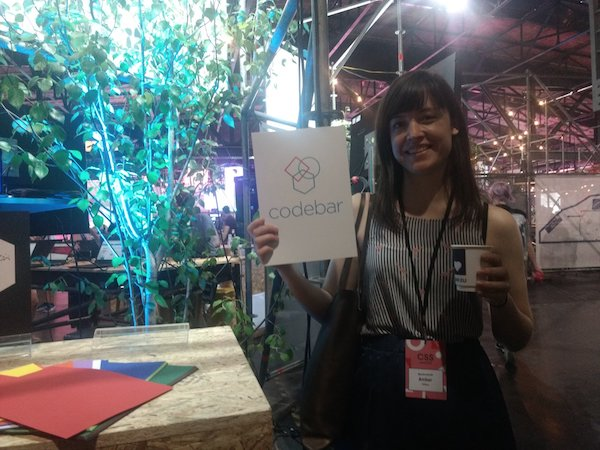
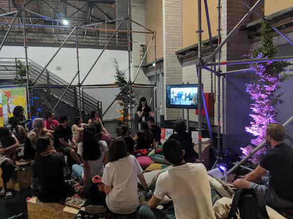

One month ago, I was invited by [Vanessa](https://twitter.com/vanessayuenn) and [Michele](https://twitter.com/sheley) to speak at the JSConf EU community lounge in sunny Berlin. This was a tremendous honour - not only would I be able to talk about how great [codebar](https://codebar.io) is to a crowd of eager attendees, but I'd be able to participate in both [CSS](https://2018.cssconf.eu/) and [JSConf EU](https://2018.jsconf.eu/), and catch up with lots of old and new friends.

Something I couldn't help noticing as soon as I arrived, was the fantastic effort the conference organisers put into designing a great space for everyone.

One of the best corners of this space was definitely the community lounge!

On arrival, I found the lounge prepped and pillowed-up, the sticker table and job board ready to be filled, and plenty of space available for people to watch lightning talks from local tech initiatives. The thing I was most excited about, though, was to see the codebar poster sitting proudly right at the entrance.

Across three days, there were so many great speakers who shared their local initiatives - ones that had made such a difference in their own lives. Among them were several Berlin meet ups I had long admired and attended. Wanting to give codebar every ounce of credit it deserves, I created the best presentation I could. I wanted to talk about how codebar works, and let people know how to get involved in [codebar Berlin](https://codebar.io/berlin). I also wanted to get across to the audience how much codebar means to me personally.

It was mid-2016 when I attended my first codebar in [Brighton](https://codebar.io/brighton), UK - and without exaggerating, I can confidently say that it amazed me beyond words. I remember thinking "how can it possibly be that I'm here, being introduced to codebar by fantastic organisers, inside a lovely venue, with free food?" Not only that - how was it that I got to sit with a super nice coach for TWO hours to refresh my rusty HTML and CSS? Since being supported through codebar to achieve my first internship in tech, and becoming a coach and organiser myself around a year ago, multiple students have approached me with exactly the same questions.

One of the best things about the whole experience of the community lounge for me was hearing from people who feel equally as strongly about the initiatives they are part of, and who have achieved similarly wonderful things - all through the tireless efforts of volunteers who make such things possible.

Here is the list of everyone who did a lightning talk ⚡ -

*   ClojureBridge / Dani
*   PyLadies / Jessica
*   Summer of Code / Laura
*   Spektrum / Wolf
*   BerlinJS / Robin
*   It’s a Volunteer’s World / Dajana
*   Alva / Julian, Markus, Tilman
*   Women Tech Makers Berlin / Corina
*   OMGDPR / Chris
*   NodeSchool Berlin / Finn
*   Choose Your Own Instrument / Tiffany
*   Simply Secure / Eileen
*   Common Voice / Mike
*   CSSClasses / Katrin
*   AfroTechFest / Debs
*   codebar Berlin / Amber
*   UpFront / Katharina
*   Rails Girls (Code Curious) / Ferdous
*   ReDi School / Inana & Obay
*   Open Tech School / Mohamed

See the tweet below that links to each and every initiative and the people who spoke about them!

<blockquote>
    
🤩🌈 The Community Lounge is welcoming 20 unique presentations across all three conference days at
        <a href="https://twitter.com/CSSconfeu?ref_src=twsrc%5Etfw">@CSSconfeu</a> and <a href="https://twitter.com/jsconfeu?ref_src=twsrc%5Etfw">@jsconfeu</a>.  We&#39;re
        so thrilled to have an amazing program that showcases people who are doing remarkable and noteworthy
        work in the community ⚡️
&mdash; JSConf EU (@jsconfeu) <a href="https://twitter.com/jsconfeu/status/1002246925226307584?ref_src=twsrc%5Etfw">May 31, 2018</a>
</blockquote>

I want to sincerely thank the organisers of CSSConf EU and JSConf EU for being so kind to invite codebar, and all of the other great initiatives that provide safe spaces for people to learn. I want to give a special shout out to [Jan](https://twitter.com/janl) who was an amazing host. It was an incredible opportunity to spread information about the great things codebar makes possible. I am really, really excited to report that on the Monday after the conferences, we had the [busiest Berlin codebar](https://twitter.com/codebarBerlin/status/1003900234613907456) on record - and I can't wait to see what else we can do to help even more students learn and discover possibilities for themselves in tech.

If you'd like to get more involved in codebar - we are always looking for more students, [coaches](https://codebar.io/coaches) and [sponsors](https://codebar.io/sponsors)! - please see (and sign up on) our [website](https://codebar.io), check out our main [Twitter](https://twitter.com/codebar) (each chapter around the world has their own Twitter account), email us at [hello@codebar.io](mailto:hello@codebar.io), see our main [Facebook](https://www.facebook.com/codebarHQ/?ref=br_rs) and [Instagram](https://www.instagram.com/codebarhq/) accounts, find our [Slack](https://codebar-slack.herokuapp.com/) channels, and see this [PDF](pdf/codebar-information.pdf) about codebar Berlin for a closer look into what each of our 25 chapters around the world do! ❤️