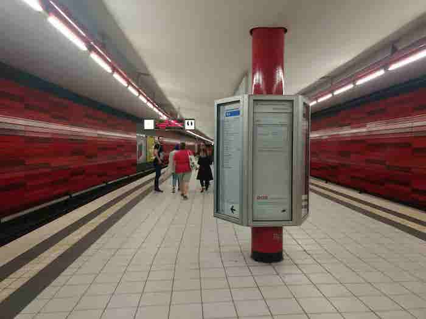
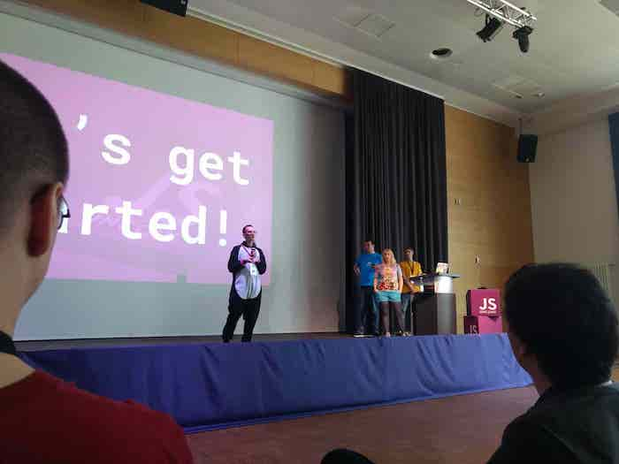
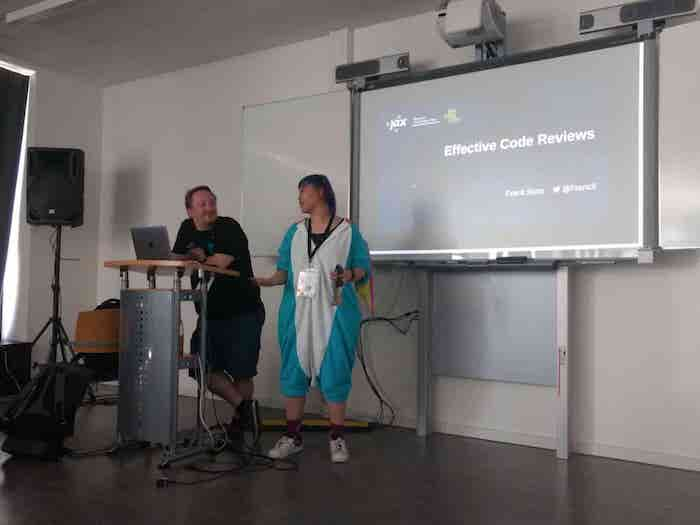
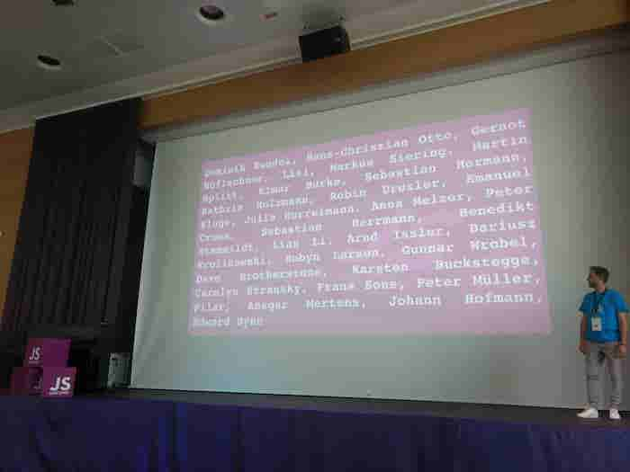
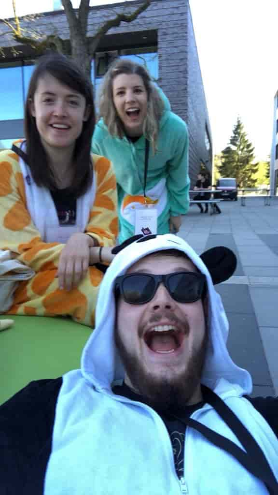

The first [unconf](http://2018.jsunconf.eu/) I’ve ever been to just wrapped up and it’s been a really great experience. Not least because of the thoughtful, kind and funny people I was lucky enough to spend it with.

First of all, I must say that I am exhausted from all of the fun, but I am tired in the best possible way. On top of the tiredness is a feeling of deep contentment, relaxation and all-round good vibes from my experiences. At the conference, everybody was approachable and easy to talk to. The organisers did a fantastic job of getting potential speakers together, introducing them and allowing us to vote for the talks we wanted. We were fed good food, given plenty of yummy snacks, and lots of great swag! The socks must be my favourite.

For those who haven’t been to an unconference before, this is how it works (well, from what I experienced this weekend) - those who wish to speak are asked to propose their talks before the conference so that the proposals can be collected and pitched at the conference itself. All attendees arrive for registration in the morning (pick up their swag!), are introduced to the conference, hear the code of conduct are shown who to talk to if there are any problems. Then, the potential speakers give short abstracts of their talks, which are numbered. After this, attendees are given a certain number of votes and asked to vote for the talks they want to see. The conference organisers work very hard to collate the votes and quickly produce a talk schedule for everyone. The talks are a defined length (~30 minutes) and are spaced throughout the day with breaks in between. There are usually some drinks tokens provided for attendees to spend at a bar where everyone gathers at the end of the first day.

At JSUnconf, there was also the opportunity to spend plenty of time relaxing outside with old friends and new friends, getting into some great conversations. The atmosphere the organisers provided for everyone felt wonderful to me. It definitely helped that Hamburg was kind enough to give us some great sunshine!

There were lots of little things I noticed that the organisers had put in place to help us feel more comfortable and welcome. Little things like placing toiletries and other helpful small things in the bathrooms. I am always so grateful for these little things. I think they make a big impact on how comfortable everyone feels.

Overall, I learned a lot from the talks and from chatting with the absolutely amazing people who attended. I want to thank all of the organisers for offering me a scholarship ticket including travel and hotel, and being so open and approachable even while running around for us trying to provide everyone the best experience. I always leave events like this feeling so good and motivated. I'm really looking forward to seeing my web (ONESIE!) family again :) By the way, watch out for my mood video, coming soon :D

   

Thanks to [Dominik Kundel](https://dkundel.com/) for inviting me and sorting out the Airbnb for everyone. You're a star!
