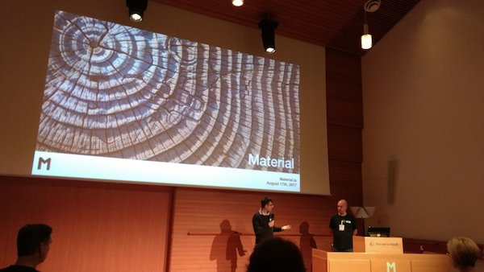
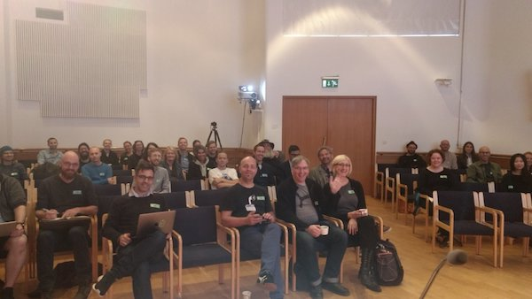
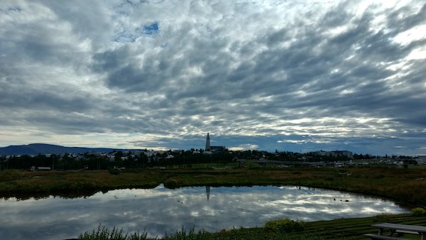

Where do I start? The preconceptions I had about the experience were inaccurate. I thought it’d be an absolutely great day – a day full of learning about the Web, meeting cool people, and achieving my first big talk. Those things turned out to be included for sure. The thing is though... it was also so much more.

There’s an element of magic in the air that you get to grasp and breathe in when you gather in the same place with so many different people – people with stories and paths they could write books about. The passion, the ideas, the stories of difficult journeys (the behind-the-scenes that you never see on social media). All of this makes not a basic recipe for a good time, but one for a delicious, enlightening experience that I’ve not seen replicated in any other environment.

The hall was oddly calming – the carefully thought-out architecture making me feel peaceful. The podium was there, I checked my computer and everything worked fine from the start. I felt the tiniest pang of nervousness, but no more.

We started just a few minutes after 9am with a talk by [Solidwool](http://www.solidwool.com/) that taught me things I hadn’t expected to learn and won’t ever forget. Then the chocolate talk by [OmNom](https://www.omnomchocolate.com/) – listening to the inner workings and philosophies of an upcoming, innovative brand of chocolate made in the heart of Reykjavik. I tried some of it and said I wished they’d always keep experimenting. Then it was my turn. I stood up on stage. I managed to smile. I gave my talk with as much passion as I could and hoped people felt that. Once I sat down, several people congratulated me, and more did throughout the day. The mini talk by [Halldór](http://halldor.eldjarn.is/) was mesmerising. He achieves something incredible - pairing music and technology – a synthesis that can create original mixtures of sounds nobody has ever heard before. Next was a fantastic talk by Icelandic designer [Goddur](http://cargocollective.com/goddur), master of his craft, who knows his material so well that he spoke with little or no prep and plenty of tonal variety in the right places (something I want to work on).

Lunch time was tasty, intriguing and culturally satisfying. We ate great food, talked in depth on a few topics, and enjoyed a hugely thought-provoking art gallery. After lunch was [Tristan](http://www.bbc.co.uk/rd/people/tristan-ferne) from the BBC talking about storytelling and the many different ways you can do this. This was very exciting to me. Then was [Tristan](http://flow.is), who also had little or no preparation, pouring forth her passion for Icelandic nature, meditation, and how she’s combining this with an exciting, up-and-coming technology. Even her voice made me feel I was meditating. I tried her VR headset and meditation program. I felt instantly calmed. After coffee, we heard from Dan who talked about remembering people in design – something overlooked but crucial. Then we heard [Tommy](https://twitter.com/TommyStadlen) who talked about Polaroid and going back to the physical, to what makes us feel all warm and fuzzy. I never knew vinyl sales was a billion-dollar industry now.

This conference was unusual. The speakers all so different. The [location](http://nordichouse.is/en/) unique. How _could_ my preconceptions have been accurate? They couldn't have been. I found though, that when you have little idea of what’s coming, you’re able to be so much more immersed in it. Something sparks, then clicks, then you see magic unfold before you. I gained a truly meaningful experience – one that I am immeasurably glad to have been a part of. [Joschi](https://jkphl.is) and [Brian](http://suda.co.uk) – thank you for taking this conference from idea to reality and bringing us all together for such a special time. I have no doubt that people walked away invigorated and full of ideas about looking at different materials and how they can inform the Web. I can’t wait for the next one. I urge anyone to go - but make sure to make some room in your brain first. You're gonna need it.

 
 
 

Also published on [Medium](https://medium.com/@ambrwlsn90/material-conference-6e9342f5eada).