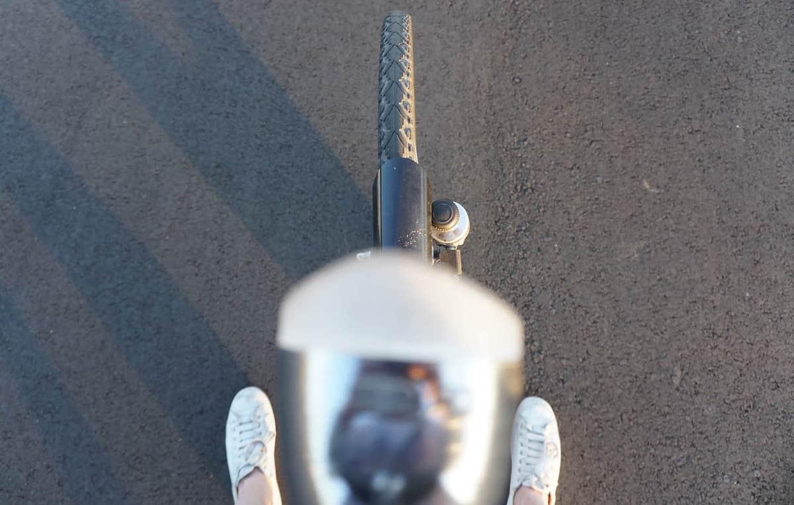
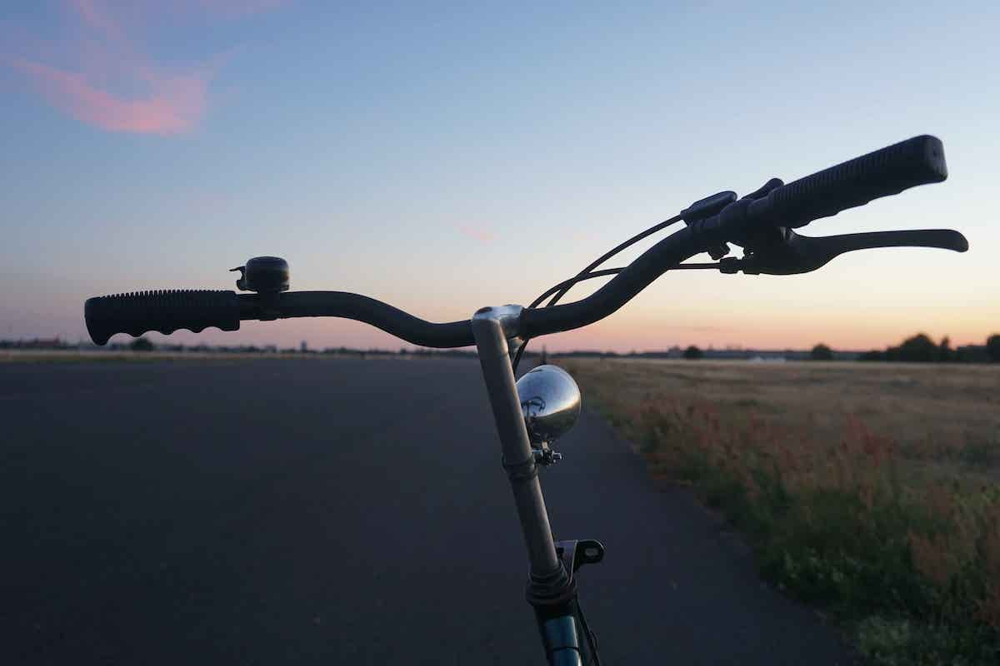
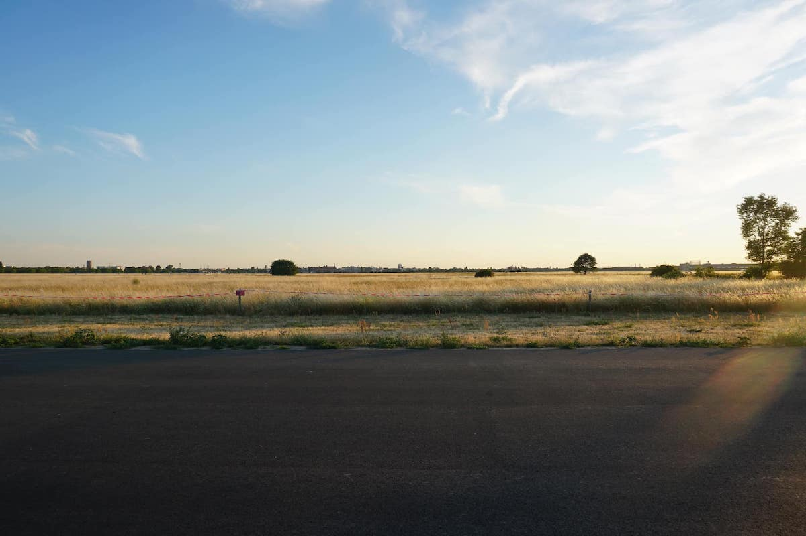

I got a new camera. It's really lovely. Why do people buy cameras though? Is it to take pictures of their friends, to sit there looking pretty but gathering dust, or to attempt to be recognised as a terrific photographer? Perhaps it is all or none of these. I got mine because I want to have a cool, small piece of equipment on me at all times that I can whip out and make some memories with. I'm not nearly as excited to edit the crap out of the pictures as I used to be a few years ago when I was using my clunky Nikon D5100 though. I also want to take videos with it, and it takes 4K video. Pretty sweet. Although the built-in stabilisation is bad so I'll need one of those fancy stabilisers on a stick. Here are a few unedited pics I took at Tempelhof Field in Berlin (compressed to 0.43 MB in total, and 336kb for people able to view WebP images.

