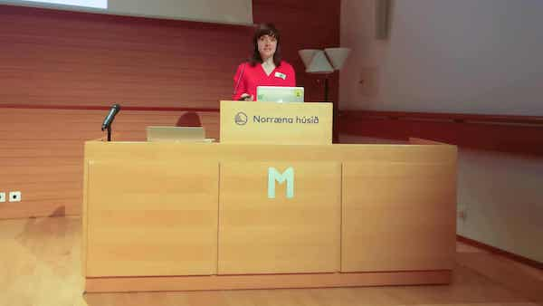

Originally published here: [#upfront conversation with Amber Wilson](http://weareupfront.com/2017/10/20/upfront-conversation-amber-wilson/)

A couple of months ago, I arrived in Iceland to do my first conference talk and I want to share that journey with you.

A year ago, with years of psychology study and experience under my belt, I moved to Brighton to begin my path towards becoming a psychologist. Soon after, I tried out my first codebar meeting because I’ve always secretly been interested in Web development. On that first evening, I met some of the organisers – three incredible, confident and successful women – [Charlotte Jackson](http://www.lottejackson.com/), [Rosa Fox](http://www.rosaemeraldfox.com/), and [Dorothy Wingrove](https://twitter.com/notthepoint). I was in awe of them. I remember thinking ‘Wow, how are these women so calm, so confident, and so accomplished?’ It wasn’t very hard to make the decision to go back.

Every single Tuesday after, I went to learn to code and hang out with the fantastic organisers and coaches. One of the evenings, I had a chance meeting with my future mentor, [Jeremy Keith](https://adactio.com). I impressed him with my enthusiasm! I was lucky to meet even more people through him – one of whom, [Joschi Kuphal](https://jkphl.is/), had heard that I’d studied and worked in psychology for years. Six months ago, he asked me if I’d like to speak at a brand new conference he was running in Iceland with a friend – one called [Material](https://web.material.is/2017/) that looks at what other disciplines can bring to Web development. I agreed right away because it sounded so exciting. The chance to go to a beautiful country, share what I’m passionate about, hear great speakers, meet interesting people, and help pioneer a cool new event? Yes, please!

I had six whole months to prepare, had great support from the people around me (especially my mentor), and I knew I could speak passionately about psychology – a subject I love. So, I rationalised I’d be okay!

I knew deep down, though, that I was woefully unprepared to get up and speak for half an hour in front of a large, expectant, intelligent crowd.

‘Not only had I not written such a long talk before, but I absolutely hated speaking in front of people – it wasn’t something that came naturally to me at all. In fact, I’d find any way to avoid it whenever I could.’

However, I do love a good challenge, and I always jump at chances to improve myself. Right away, I set to work on getting as much public speaking experience as possible. I joined a lovely, friendly [Toastmasters](http://brightonandhovespeakersclub.com/) club (where I found another brilliant mentor, [Pat Young](http://www.edgecon.co.uk/)), attended a few public speaking workshops and practised my talk in front of people at every opportunity.

I heard tonnes of inspirational people speaking, either at conferences or online – I attended conferences such as [Beyond Tellerrand](https://beyondtellerrand.com/), [UX London](https://2018.uxlondon.com/), and [Patterns Day](https://patternsday.com/). I watched lots of Ted Talks and Toastmasters speakers online and tried to analyse their speaking styles. I read books on public speaking – including [‘Talk Like TED’](http://www.carminegallo.com/books/talk-like-ted/) (a book about how Ted speakers are able to give such good talks) by Carmine Gallo, [‘Speaker Camp’](https://www.pearson.com/us/higher-education/product/Unger-Speaker-Camp-A-Self-paced-Workshop-for-Planning-Pitching-Preparing-and-Presenting-at-Conferences/9780133551648.html) by [Russ Unger](https://twitter.com/russunger?lang=en) and [Samantha Starmer](https://twitter.com/samanthastarmer?lang=en), and [‘Demystifying Public Speaking’](http://larahogan.me/speaking/) by [Lara Hogan](http://larahogan.me/).

I began to ask everyone I could what their number one public speaking tip was, wrote them all down, and was surprised to see that everyone said something different.

Some of the tips include smiling, not saying ‘I think I can do it’ but ‘I CAN do it’, owning it, not saying sorry if you mess up, PAUSING, etc.

I got warm advice and thoughtful feedback from the people who wanted me to succeed – which was everyone.

This is another tip to remember: everyone wants you to succeed – they are all on your side.

I spent countless hours taking in their feedback and altering my talk, practising it again in front of people, and altering it again. In the weeks before the conference, I began to feel so calm and confident speaking in front of people – whether they were big or small groups, full of people I knew, or full of people I didn’t know. A few months before, I was a nervous wreck speaking in front of anyone. I’d experience the familiar adrenaline rush, butterflies, and shallow breathing and would sweat, shake and clam up.

The day of the conference finally arrived. I’d been preparing for so long that it almost felt just like any other day. I stood up on stage, gave my talk – and… aced it! I was confident, spoke clearly, kept a great rhythm, and people congratulated me afterwards. I inspired the people in the audience! I helped make the experience worthwhile and thought-provoking for them.

Would I say to other women: ‘You can do it?’ Yes, yes, and yes. You can get up there on stage and share your ideas. In fact, you absolutely should, because you have so many amazing things to offer.

I think it’s extremely sad when women shy away from the stage because they think nobody can learn something from them, or nobody will listen to them, or they’d rather be pushed off the top of a building than speak in front of people.

I am living proof that with some focus on practising your skills, you can completely turn yourself from super-scared to super-speaker in a few months! All the advice, all the support from mentors and friends, all the practice, all the hard work, all the feedback, all the reading, all the getting out of your comfort zone, it all works.

I’ve never used the term miracle to describe anything before, but this is exactly how I describe what happened to me. I improved so much in such a short time, it feels like it simply can’t be real. But, it is real and I am reaping the benefits, as well as managing to inspire other people in the process.

I am showing women that we can be up there, that we are important in this industry. I really can’t wait to do more things like this. And, I’ve been challenged to wear heels next time I do a talk. I think I will do that. Challenging myself has been a wonderful exercise so far – why not see if this is the case in the future too.

If you are currently trying to think of potential topics for conferences and you’re stuck, try a small exercise. Write down the things you are most passionate about. Great speakers are always passionate about their topic, and this shows on stage (it also shows if they have little interest in it). I love psychology and the Web. My passion was with me from my initial ideas through to getting up on stage to talk.

I’m based in Brighton and would love to meet you if you want some more tips on public speaking, if you are working on a talk, or if you have ideas you’d like to make a reality! Let’s get your voice heard!

I’m itching for my next conference invitation so if you’d like a speaker to talk about psychology, tech or anything in between please do get in touch with me on twitter [@ambrwlsn90](https://twitter.com/ambrwlsn90?lang=en) or email me at [ambrwlsn90@gmail.com!](mailto:ambrwlsn90@gmail.com)