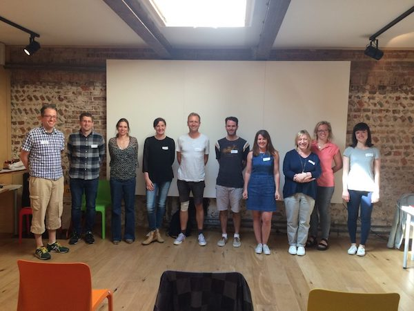

Earlier this week I attended a public speaking workshop run by [Matt Matheson](https://www.improvisingchange.co.uk/). There were ten people in the group. We wrote stories. We played games. We presented. One hour in we had already talked in front of everyone four times. The lovely thing is – everyone did really well. We were all praised and given immediate feedback and I learned something new each time I spoke.

There was no time to sit in a corner and hide during the workshop. Had we been given that opportunity, I don’t think we’d have performed nearly as well. I think there is something great to having to think on your feet, be exposed, and present talks of various lengths and types. It feels like a worthwhile challenge that you take in your stride, allowing you to perform much better than you ever thought you could. I won’t go into detail about any of the exercises – the magic behind them has to be experienced in person.

I learned that other people have very different concerns and fears around public speaking than I do and that some of us share the same fears. I learned a lot about the importance of positive praise - both receiving and giving it. I walked away with techniques I will be able to remember and utilise for a long time to come. I learned that everyone is a natural storyteller and that you never come across as bad a public speaker as you think you do. There is always a way to harness your passion for a topic and translate it to confidence on stage. It's absolutely worth getting out there and talking about things that mean something to you. You'll always find people who want to listen and will learn something from you.

Here's just a tiny snippet of the things I learned from the brilliant attendees of the workshop under Matt’s guidance:

*   Say “yes” to invitations to speak
*   Integrate your facts into a story
*   Know, engage and connect with your audience
*   Be authentic - say the good, the bad and the ugly
*   Appeal to the audience members’ emotions as well as their minds

If you'd like to discover your own fantastic tips, you can get in touch with Matt [here](https://www.improvisingchange.co.uk/get-in-touch) to ask about workshop possibilities :)

Very happy workshop participants - thanks Matt for the workshop and the pic!