This post is split into three parts. Click and choose!

1.  [Diary](#diary) of my time in Scotland
2.  [Tips](#tips) from speakers used in this blog post
3.  ✨ [Why this conference is special](#isspecial) ✨

I will post a link to the official photos once they are out! (hint: they are good).

See [Katie Fenn](https://www.katiefenn.co.uk)'s terrific and poignant article on the conferences [here](https://www.katiefenn.co.uk/scotland-js-retrospective/).

  <h1>Diary&nbsp;<a href="#diary" aria-hidden="true"> # </a>&nbsp;</h1>
<a href="#" role="link">

<svg width="53"
    height="25"
    view-box="0 0 53 25"
    xmlns="http://www.w3.org/2000/svg"
    class="back-to-the-top" role="img" aria-labelledby="title desc" aria-describedby="desc"><title id="title">Back to the top arrow</title><desc id="desc">Click this to go back to the top of the blog post</desc><path
      stroke-width="4"
      d="M2 22.5L27.46 2 51 22.5"
      fill="none"
      fill-rule="evenodd"
      stroke-linecap="round"
      stroke-linejoin="round"
    ></path></svg>
</a>

At 12.58pm on 17th July I stepped off the train into Edinburgh station. It was sunny! I noticed the architecture immediately - very beautiful and old. It wasn't long before I got to meet up with a very good web friend of mine, Flaki. We found the longest staircase we could and took our suitcases up it on our way to our accommodation. Once there we met up with two more good friends, Pilar and Ramón. After this, I met up with an old friend for dinner at The Castle Arms, before we all made our way to a Ceilidh dance [Peter](https://twitter.com/jiggy_pete) invited us to. This was a _blast_ and a perfect way to begin the great things to come!

<figure class="image__grid--two grid__captions--two">

<!-- 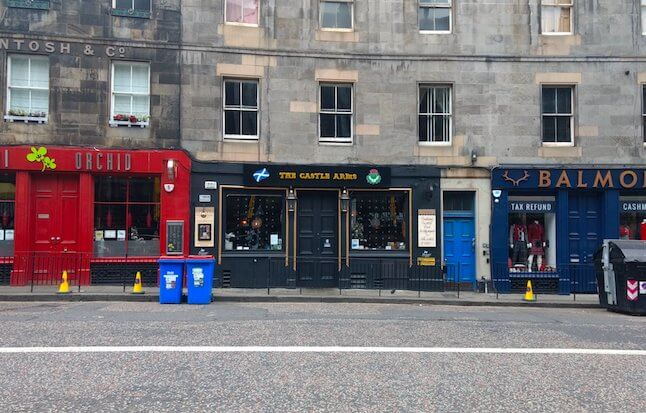 -->

<figcaption class="item2">The Castle Arms pub (photo / Me)</figcaption>

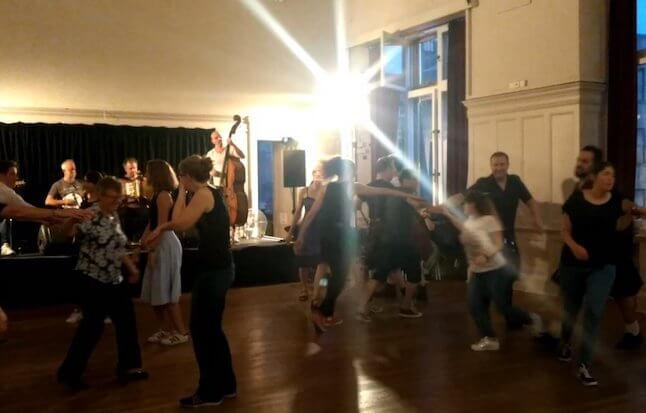

<figcaption class="item4">Ceilidh (photo / Me)</figcaption>

</figure>

At 7.15am, I walked to the conference venue, Dynamic Earth, and met up with the rest of the volunteers. I'd already met some during our code of conduct and speaker buddy training a few days previously. We got our t-shirts on and got to it. Soon the first attendees were arriving and the talks began. Peter did a great job of answering any questions we had and making us all feel very comfortable and welcome. I was so happy to hang out with my friends. I even got to see Emily and Anwen from codebar Brighton again! [codebar](https://codebar.io) is the amazing free initiative that helped me become a developer <3 <3

<figure class="image__grid--two grid__captions--two">

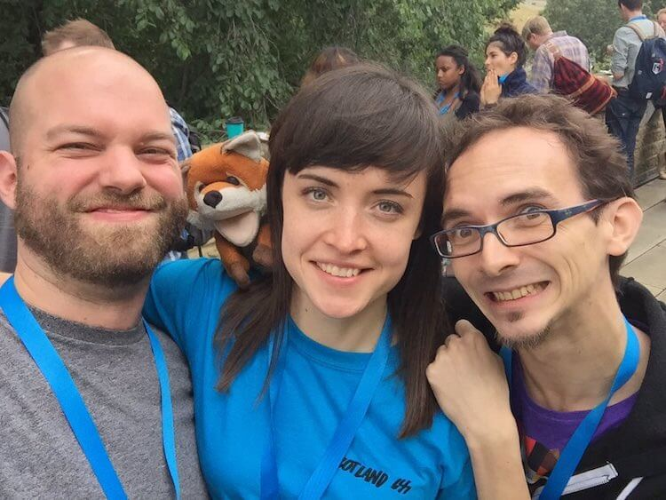

<figcaption class="item2">Fred, Bæla, me, Flaki (photo / Frederic Marx)</figcaption>

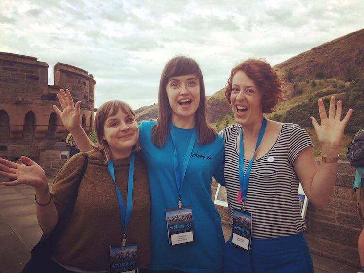

<figcaption class="item4">Emily, me, Anwen - codebar Brighton reunion! (photo / Anwen Williams)</figcaption>

</figure>

The quality of the talks at Scotland CSS were, in Peter's words, _beyond phenomenal_. The quality and variation in the topics was amazing. Each talk was 20 minutes, and in a set of three. After each set there was a separate discussion slot for each speaker, which the audience could attend to ask questions. **This was a really nice and down-to-earth format that broke down barriers between audience and speakers and allowed everyone to feel on the same level! The stage for speakers was also very low - at the level of the audience. No hero-worship of speakers here.**

<figure class="image__grid--two grid__captions--two">

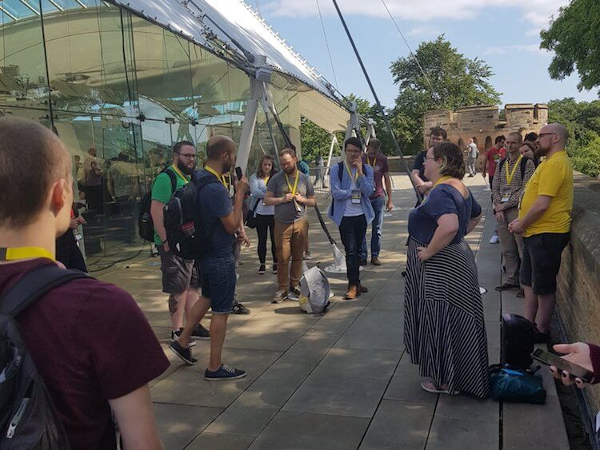

<figcaption class="item2">Speaker discussion with Meara Charnetzki (photo / © <a href="https://www.scottlogic.com/">Scott Logic</a>)
</figcaption>

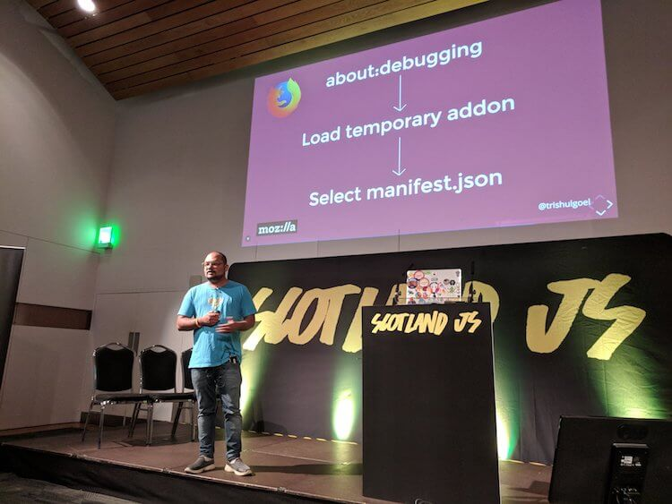

<figcaption class="item4">Trishul Goel speaking on the low stage (photo / Flaki )</figcaption>

</figure>

After Scotland CSS, some of us headed to dinner at Holyrood 9A (amazing burgers) where Emily and I had vegan haggis burgers! After this we made our way to Hemma where we had drinks with other conference goers. They had some of my favourite beer. By now, everyone was tired but we were all having such a nice time, it was really hard to drag ourselves away and go home!

At 7.45am I arrived for the second day of conferencing and the beginning of Scotland JS! This day was just as amazing as the one before. The volunteers all helped each other to see our desired talks, speak with friends and feel relaxed and happy. I am so super grateful to every single fellow volunteer there. Anwen and I met Evelyn from codebar Edinburgh. Evelyn not only volunteered but also MCed at Scotland JS! From left-to-right, we represented codebar Berlin, Edinburgh and Brighton! Nicki and I were lucky enough to be approached by avid-coder Connie (the youngest attendee at 10 years old) and her mum who asked us if we wanted to Floss! For anyone not cool enough to know, flossing overtook dabbing as the in-thing. Find the video below, featuring our very own Peter, if you are still confused.

<figure class="image__grid--two grid__captions--two">

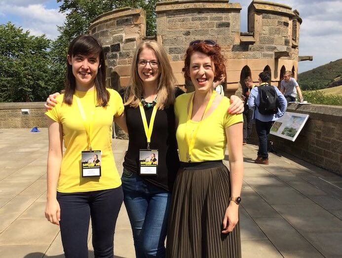

<figcaption class="item2">Me, Evelyn, Anwen - codebar times 3! (photo / Anwen Williams)</figcaption>

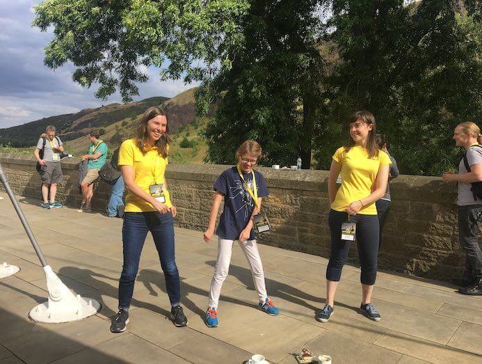

<figcaption class="item4">Nicki, Connie & me flossing (photo / Connie)</figcaption>

</figure>

The first night of Scotland JS, we were lucky to be treated to gin and whisky tasting where we sat with friends and sampled some of Scotland's finest spirits. I also had a fantastic vegan haggis baked potato (never thought I'd put those words next to each other in a sentence) with two fantastic humans. Some people went to karaoke but I was way too tired so I went to bed. Not before being shown where the deep fried mars bars were sold, though.

<figure class="image__grid--two grid__captions--two">

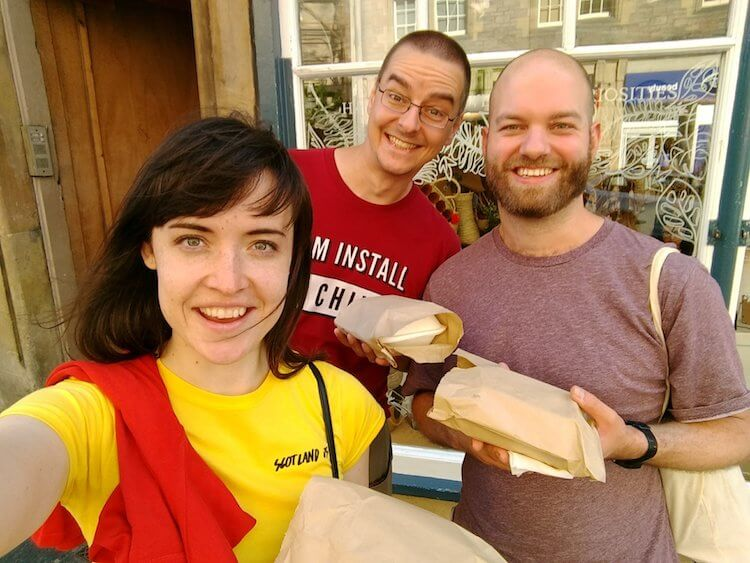

<figcaption class="item2">Potato posers - me, Peter, Fred (photo / Me)</figcaption>

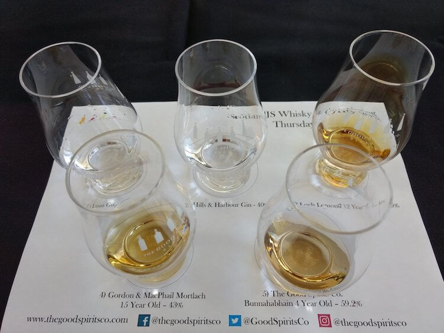

<figcaption class="item4">2 gins, 3 whiskies (photo / Me)</figcaption>

</figure>

The last day of the conference began a little later at 9am. It was just as good as the previous two days, and I already began to feel a little sad that the conferenes were nearly over. As the last speaker was wrapping up, everyone thought that was it. But, Peter had a surprise for us. Read about it at the end of this post ; )

The last night of the conferences was spent again at Hemma, amongst friends. And amonst fish and chips because Edinburgh restaurants are _really_ busy on Friday nights! I was very glad that I was staying in Scotland for one more day so I could walk around beautiful Edinburgh. I miss it and my web friends already - until next time :-)

  <h1>Tips&nbsp;<a href="#tips" aria-hidden="true"> # </a>&nbsp;</h1>
<a href="#" role="link">

<svg width="53"
    height="25"
    view-box="0 0 53 25"
    xmlns="http://www.w3.org/2000/svg"
    class="back-to-the-top" role="img" aria-labelledby="title desc" aria-describedby="desc"><title id="title">Back to the top arrow</title><desc id="desc">Click this to go back to the top of the blog post</desc><path
      stroke-width="4"
      d="M2 22.5L27.46 2 51 22.5"
      fill="none"
      fill-rule="evenodd"
      stroke-linecap="round"
      stroke-linejoin="round"
    ></path></svg>
</a>

I used tips from speakers in this blog post, because the material was just _so_ good! I wasn't able to see every speaker, but I'll watch all the videos once they are out :-) All tips are from Scotland CSS, as I'm not using any JavaScript on my site:

- [Peter Müller](https://mntr.dk/)'s "[High Performance Web Fonts](http://slides.com/munter/high-performance-web-fonts-scotlandcss#/)" was about improving performance using local fonts rather than Google fonts, font subsetting, and his node package [subfont](https://www.npmjs.com/package/subfont). He added network tab visuals to help us understand the performance benefits. I went ahead and downloaded the two Google fonts I usually access with two separates HTTP requests, and added the local versions to my site.
- [Anna Migas](https://twitter.com/szynszyliszys)'s "[Fast But Not Furious: Debugging User Interface Issues](https://www.slideshare.net/AnnaMigas1/fast-but-not-furious-debugging-user-interaction-performance-issues)" taught me the order pages load in. An event is fired (JavaScript), styles are calculated, layout is calculated, things are rasterised and painted into layers, layers are composited together. Check out a site's layers by going to the _layers_ tab in chrome dev tools! I figured out my site only has one layer as it is static and has no JavaScript.
- [Natalya](http://www.artist-developer.com/)'s "[Bootstrap to CSS Grid](https://docs.google.com/presentation/d/1dERF3H9jQ3Yb7pIIx7hzWJKxvFjyvFNvFUq-mzcx27E/edit#slide=id.g34872239f6_0_6)" encourages companies to adopt CSS Grid and explains the benefits of doing so. Grid can be gradually adopted into an existing codebase. I demonstrated this here by using it to position my images and figure captions. I used `grid-template-columns` , `grid-template-areas` , and `grid-area` to position things exactly as I want them. The mobile version of this page uses Flexbox instead. Yep, you can mix Grid and Flexbox! Check out Firefox dev tools for a great visual representation of my picture grid.
- [Sareh Heidari](https://twitter.com/Sareh88)'s "Quick Tips for Performant Websites" encouraged us to think what our users' priorities are. Sareh taught us about some resource hints to give browsers a helping hand loading things. I had not heard of these before. See an artice [here](https://css-tricks.com/prefetching-preloading-prebrowsing/) on how resource pre-fetching helps performance. I tried using `dns-prefetch` here to pre-fetch the twitter widgets in this post.
- [Jessics Rose's](http://jessica.tech/) talk on [Impostor Syndrome and Individual Competence](https://www.youtube.com/watch?v=nbg2Is6VOCM) taught me something completely new. Not something technical that I can add to this post, but something really important. About how feeling yourself struggle means growth. You have stuff that's too easy and stuff that's too hard and right in the middle of the venn diagram (the _zone of proximal development_) is where you should be, in order to grow. Challenging and pushing your mind. It can feel uncomfortable - this is where imposter syndrome can often kick in. But in these cases, it helps tremendously to give yourself a gentle reminder that you are absolutely fine. Of course while remembering to give yourself sufficient periods of rest to recover from the sustained effort of learning.
- [Steven Robert](https://twitter.com/matchboxhero10)'s "CSS Animation - Best of the Web" was my favourite talk. I really couldn't wait to have a go at creating my own animation using code. He showed us how to use SVGs in separate cells (frames) with keyframes and animation properties to create just about any animation we'd want. A link to his codepen is [here](https://codepen.io/collection/nkBVzK/), and a link to his bird animation that inspired his talk and the below rabbity animation is [here](https://codepen.io/matchboxhero/pen/RLebOY). Scroll to number 4 in [this](https://www.creativebloq.com/inspiration/css-animation-examples) list for the tutorial. Steven helped me out when I had questions and I'm really grateful for that :-) Through making the rabbity animation (codepen [here](https://codepen.io/ambrwlsn90/pen/ajVReX)), I learned more about SVGs and how the viewBox attribute works.

  

<h1>Why This Conference is Special&nbsp;<a href="#isspecial" aria-hidden="true"> # </a>&nbsp;</h1>
  <a href="#" role="link">
  
  <svg width="53"
    height="25"
    view-box="0 0 53 25"
    xmlns="http://www.w3.org/2000/svg"
    class="back-to-the-top" role="img" aria-labelledby="title desc" aria-describedby="desc"><title id="title">Back to the top arrow</title><desc id="desc">Click this to go back to the top of the blog post</desc><path
      stroke-width="4"
      d="M2 22.5L27.46 2 51 22.5"
      fill="none"
      fill-rule="evenodd"
      stroke-linecap="round"
      stroke-linejoin="round"
    ></path></svg>
  </a>

I believe the technology community and related events can learn a lot from Scotland CSS and Scotland JS.

I think Frederic did a good job explaining why.

<blockquote>

  
Resting up after an intense week of <a href="https://twitter.com/ScotlandCSS?ref_src=twsrc%5Etfw">@ScotlandCSS</a>                                    and <a href="https://twitter.com/ScotlandJS?ref_src=twsrc%5Etfw">@ScotlandJS</a>. ☕️🛋🎶  Thanks
      so much to <a href="https://twitter.com/jiggy_pete?ref_src=twsrc%5Etfw">@jiggy_pete</a>                                    &amp; team for fostering a community that’s equally inclusive and transformative for
      long-time industry experts, as well as total beginners, and everyone in between.
&mdash;
  Frederic Marx (@fredericmarx) <a href="https://twitter.com/fredericmarx/status/1021026409903423490?ref_src=twsrc%5Etfw">July 22, 2018</a>

</blockquote>

Scotland CSS and JS is created and curated by [Peter Aitken](https://twitter.com/jiggy*pete). The community Peter works so hard to build (not only at these conferences) is \_inclusive\* and _transformative_ for _everyone_, no matter what their level. At some conferences, I have felt left out in favour of developers who are much more established. I didn't feel like that for a second at Peter's conferences. On the contrary, I felt safe, welcome, and included.

I am thrilled that so many others seemed to have a similar experience.

<blockquote>

  
<a href="https://twitter.com/ScotlandJS?ref_src=twsrc%5Etfw">@ScotlandJS</a> is the first Tech
      conference in 10 years in Europe, where I felt that people like myself, and <a href="https://twitter.com/CodeYourFuture_?ref_src=twsrc%5Etfw">@CodeYourFuture_</a>                                students, are first-class citizens. Thank you <a href="https://twitter.com/jiggy_pete?ref_src=twsrc%5Etfw">@jiggy_pete</a>                                for making a Tech event that is genuinely and sincerely welcoming and inclusive to *others*
      1/3
  
&mdash; Mozafar (@kabaros) <a href="https://twitter.com/kabaros/status/1021516957810675723?ref_src=twsrc%5Etfw">July 23, 2018</a>

</blockquote>

On the first day of the conferences, at Scotland CSS, the first thing we all saw was one of the code of conduct banners. The other banner (not shown here) had the short AND long version of the code of conduct written on it. We were also introduced to our lovely code of conduct team - Evelyn, Katie, Nicki and Peter. I've never seen or experienced the code of conduct being enforced in such a diligent or more organised way. It made me feel very safe and I hope it did the same for others.

<figure class="image__grid--two grid__captions--two">

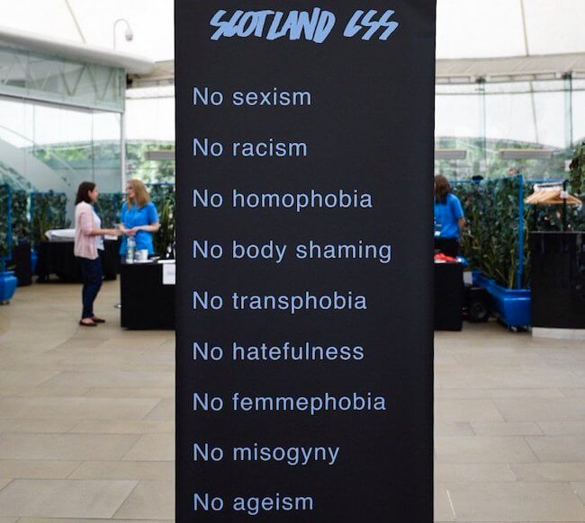

<figcaption class="item2">Code of Conduct banner (photo / <a href="https://www.juliebee.co.uk/">Julie Broadfoot</a>)</figcaption>

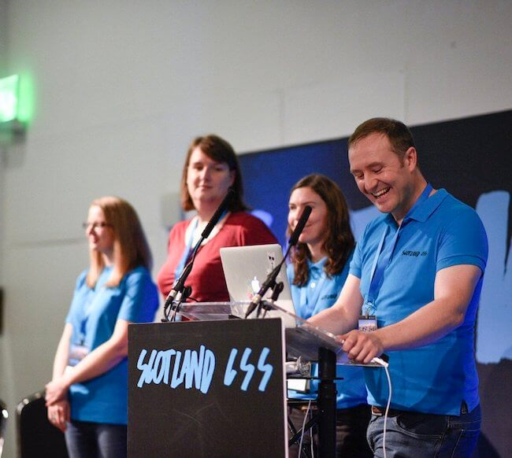

<figcaption class="item4">Code of Conduct team (photo / <a href="https://www.juliebee.co.uk/">Julie Broadfoot</a>)</figcaption>

</figure>

The youngest attendee, Connie, was 10 years old. Peter introduced her to us and all the great work she's already done. I was lucky to get to speak (and dance!) with her. I heard about the adventures she's been on with coding so far, saw some of her work and chatted with her about Harry Potter. She is a Gryffindor.

<blockquote>

  
So pleased to welcome our youngest attendee to <a href="https://twitter.com/hashtag/scotlandjs?src=hash&amp;ref_src=twsrc%5Etfw">#scotlandjs</a>                                  We’re glad you had an amazing time and can’t wait to find out what you create in
      the future 💛
      <a href="https://t.co/HlX3xPT106">https://t.co/HlX3xPT106</a>
  
&mdash; Scotland JS (@ScotlandJS) <a href="https://twitter.com/ScotlandJS/status/1020631634524196864?ref_src=twsrc%5Etfw">July 21, 2018</a>

</blockquote>

Connie was also [Upfront](http://weareupfront.com/). Other people were too, including my good friend Anwen. I first learned about being Upfront last year at UX London where I met the great Lauren Currie. She is from Scotland and has done a tonne of amazing work - check it out [here](http://www.redjotter.com/). She wanted a way for people to get experience being on stage without having to speak. What happens is a few chairs are set up on one side of the stage, and aspiring speakers sit down while a speaker gives their talk. Lauren hopes these people gain enough confidence to speak one day. I am on the Upfront [blog](http://weareupfront.com/blog/) :-)

As I mentioned in the first section of this post, there was a low stage, and also face-to-face speaker discussion - both of which broke down barriers between speakers and attendees. There has been talk around 'hero-worship' of speakers at some conferences. This certainly was not the case here, and I'm sure many people had a much more genuine experience because of it.

Some things weren't as obvious as inclusive measures at first glance, but they were there. For example, Peter convinced the venue to add gender-neutral toilets. He took the advice of [Nat Tarnoff](http://tarnoff.info/) on adding animation warnings for those with vestibular disorders, and also added warnings about flashing lights and loud videos. There was plenty of vegan and vegetarian food and snacks. Based on past feedback, Peter set a board game evening up to run alongside gin and whisky tasting for those who didn't want to drink.

<blockquote>

  
Scotland CSS &amp; Scotland JS was certainly a team effort: organizers, volunteers, speakers,
      even attendees (who, as ticketholders, got to vote &amp; decide on the final lineup) — worked
      together tirelessly to make it happen…  BUT.  I need to leave this here:
      <a href="https://t.co/M4ToVpPou7">https://t.co/M4ToVpPou7</a>
&mdash; 𝔣𝔩𝔞𝔨𝔦 (@slsoftworks)
  <a href="https://twitter.com/slsoftworks/status/1021434833292222465?ref_src=twsrc%5Etfw">July 23, 2018</a>

</blockquote>

This conference feels different to any I've been to before, and by now I have been to quite a few. This feeling began even before the conference began, with a video call from Peter. He took time to have a face-to-face conversation with me to tell me all about what volunteering would involve. After I'd agreed to volunteer (not a hard decision at all), Peter arranged for [Katie](http://www.katiefenn.co.uk/) and [Alan](https://twitter.com/mr_urf) to have a video call with all volunteers. On this call, we were able to learn more about the code of conduct and how to help out speakers on the day. At all times before, during and after the conference, Peter would reply to questions quickly and enthusiastically.

This is the first conference, event, meetup, anything that I have been to that made me really, truly feel that change is really possible. By this I mean change in people's attitudes to diversity in tech, and diversity everywhere else too. As a white person in tech, I have plenty of privilege. As a woman in tech, I've also felt an undercurrent of discrimination. I hope these two postions / viewpoints help me to be more aware and empathetic towards the experiences of everyone. I am definitely aware that there are people in tech, and everywhere, that are not comfortable feeling uncomfortable. By this I mean certain people are much more likely to sweep certain people's experiences under-the-rug than do something to help.

Peter surpised us with an unexpected speaker at the end of Scotland JS.[Kim Crayton](http://www.kimcrayton.com/) spoke to us about privilege, diversity, and how we need to get comfortable with being uncomfortable. So that we can change where tech is heading today, allow everyones voices to be heard (not only a select, privileged few), and work towards a world where every single person feels safe in their own skin. I had a second surprise, and it seems nobody else saw it coming either, but this was to be the last Scotland CSS and Scotland JS. Peter, speaking slowly and purposefully, told us that his focus going forward must be on [Global CFP Day](https://www.globaldiversitycfpday.com/), a worldwide event that helps people begin speaking and sharing their knowledge and experiences. See a photo below of the Berlin version that I was lucky enough to mentor at back in February - one of over _50_ events worldwide. Also see Rachel Andrew's [post](https://www.smashingmagazine.com/2018/02/getting-started-public-speaking/) about it.

<figure class="image__grid--two grid__captions--two">

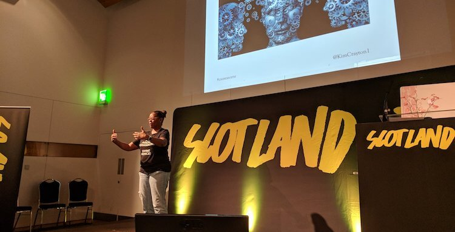

<figcaption class="item2">
<a href="http://www.kimcrayton.com/">Kim Crayton</a> (photo / Flaki)
</figcaption>

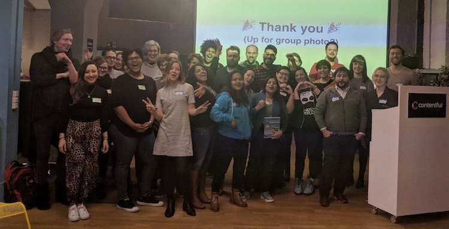

<figcaption class="item4">
CFP day in Berlin (photo / <a href="https://twitter.com/priyankanaik625">Priyanka Naik</a>)
</figcaption>

</figure>

A third surprise awaited us. Peter got onto the stage once more to announce that with the rest of the conference money, he was going to donate 10 computers to [Code Your Future](https://twitter.com/CodeYourFuture_) - a UK-based coding school for refugees who want to become web developers.

It was hard to fight back the tears when Peter's family came on stage to hug him and his wife said she is really proud of him. It must be safe to say that we are all endlessly proud of Peter, and the genuine enthusiasm, kindness and tireless hard work he puts into what he does._Thank you_, Peter Aitken!

 

  <blockquote>
The Floss <a href="https://twitter.com/ScotlandJS?ref_src=twsrc%5Etfw">@scotlandjs</a> <a href="https://twitter.com/hashtag/scotlandjs2018?src=hash&amp;ref_src=twsrc%5Etfw">#scotlandjs2018</a> edition <a href="https://twitter.com/hashtag/Floss?src=hash&amp;ref_src=twsrc%5Etfw">#Floss</a> <a href="https://twitter.com/hashtag/flossing?src=hash&amp;ref_src=twsrc%5Etfw">#flossing</a> <a href="https://twitter.com/jiggy_pete?ref_src=twsrc%5Etfw">@jiggy_pete</a> <a href="https://twitter.com/waffles193?ref_src=twsrc%5Etfw">@waffles193</a> <a href="https://twitter.com/herecomesjaycee?ref_src=twsrc%5Etfw">@herecomesjaycee</a> <a href="https://t.co/KFvyl7QNOq">pic.twitter.com/KFvyl7QNOq</a>
&mdash; Amber Wilson (@ambrwlsn90) <a href="https://twitter.com/ambrwlsn90/status/1019969967586934784?ref_src=twsrc%5Etfw">July 19, 2018</a></blockquote>

