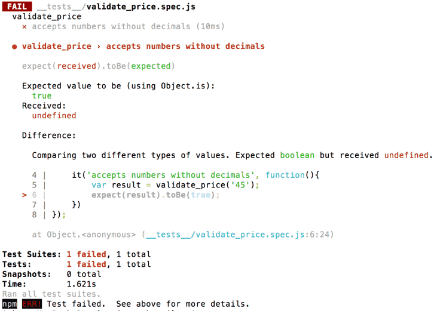
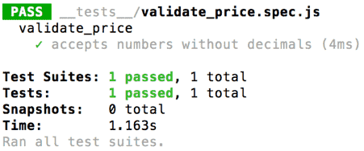
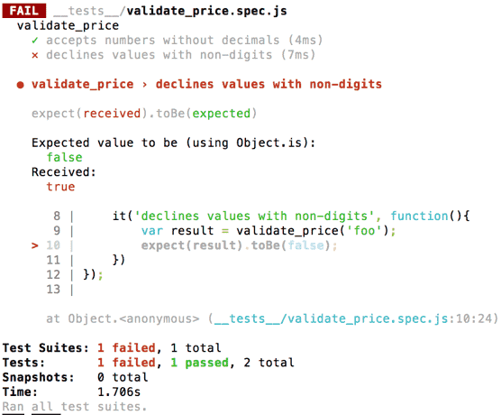

This is a bit of a retrospective post, because the things I’m going to talk about happened on the last day of January. It was the day before my new job began, and I’d been in Berlin for 10 days. I had signed up to a codebar Berlin meetup about a week before, as a student, and was really excited to go along and see what codebar in Berlin was like. Before I moved to Berlin, I’d been part of codebar Brighton for about 1.5 years as a student, coach and organiser.

I had chosen to focus on the 7th JavaScript lesson – [Introduction to Testing](http://tutorials.codebar.io/js/lesson7/tutorial.html). There was a good reason for this! After my first 6-month long internship as a web developer, I had either worked on or had an overview of a few large projects. I'd seen every developer devote a really large chunk of time to testing their code - and in multiple different ways. So I knew that **testing is really, really important**, and I definitely wanted to know more about it. I knew that unit tests are designed specifically to test code in isolation, and that they are the simplest ones to write and run. So, I decided I wanted to ask my coach about unit tests, and hopefully try writing some.

When I arrived at codebar, I found the venue, hosts, organiser, coaches and students to be really wonderful. I was paired with a lovely guy, [Dave](https://twitter.com/bruderstein). I asked him about unit tests and he said rather than follow the tutorial, it'd be a nice idea to search through one of my [existing projects](https://github.com/ambrwlsn/christmas-gifts), take a snippet of code from it, and re-write it using unit tests and TDD (Test-Driven Development). I've written more about TDD below.

The code in question was this function:

```javascript
function validatePrice() {
  var $price = document.getElementById('price')
  var priceValue = $price.value
  var regex = /^[1-9]\d*(((,\d{3}){1})?(\.\d{0,2})?)$/
  var invalidMessageNotDisplayed =
    document.querySelectorAll('.invalid_price_span').length <= 0
  var isValid = regex.test(priceValue)
  if (!isValid && invalidMessageNotDisplayed) {
    showInvalidPriceMessage($price)
  }
  return isValid
}
```

This function is designed to validate user-inputted prices. It isn’t the messiest function ever, but there is definitely room for re-factoring.

Dave suggested we use the popular testing framework [Jest](https://facebook.github.io/jest/), and the command line, to help me re-write the function, and write my first ever unit tests.

I created a new folder with the command line `mkdir price`, I targeted the folder `cd price`, and ran `npm init`. My `package.json` data was created. I then ran `npm install --save jest`. My `package.json` then looked like this:

```javascript
{
    "name": "price",
    "version": "1.0.0",
    "description": "",
    "main": "index.js",
    "scripts": {
        "test": "jest"
    },
    "author": "",
    "license": "ISC",
    "dependencies": {
        "jest": "^22.1.4"
    }
}
```

I opened my text editor and added my new price folder to my workspace. Within the folder, I created a file - `validate_price.js`. In here, I created an empty function - `validate_price`. Beneath the function, I made sure to add a line of code that enables the file contents to be exported - `module.exports = validate_price`. I then created a sub-folder - `__tests__`. I formatted the name like this so Jest can recognise it. In this sub-folder, I created a file - `validate_price.spec.js`, which Jest can also recognise. In this file, I wrote - `var validate_price = require (‘../validate_price’)`, to link it with my `validate_price` function.

Dave then showed me the syntax for writing unit tests with Jest:

```javascript
describe('validate_price', function() {
  it('accepts numbers without decimals', function() {
    var result = validate_price('45')
    expect(result).toBe(true)
  })
})
```

I had just written my first ever unit test! I ran `npm test` in the command line, triggering Jest to run. The result was:



The result helpfully informed me that my `validate_price` function was still empty (i.e. not defined). I then wrote just two words inside my function, ‘return false’. I ran `npm test` again. I got another failed test. This is because the expected value (boolean) had been ‘true’, and it had received the boolean ‘false’. When I changed the boolean to ‘true’, the test passed!



I then added a second unit test to my `validate_price.spec.js` file:

```javascript
it('declines values with non-digits', function() {
  var result = validate_price('foo')
  expect(result).toBe(false)
})
```

What do you think would happen if `npm test` was run now? You may or may not have guessed correctly, but we get this:



This is because we have ‘true’ written in our function, and the expected result of this test is ‘false’. So our first unit test passes, and our second one fails. This is easily fixed by creating an ‘if, else’ statement that returns true or false, depending on whether the input is a number or not.

It was at this point that Dave began to further explain what Test Driven Development (TDD) is. This is an agile method whereby an empty function is written, and each part of the function is written just well enough so it passes a test written specifically for it, and is then refactored. This helps code to be as DRY and readable as possible. Read more about TDD [here](<https://www.agilealliance.org/glossary/tdd/#q=~(filters~(postType~(~'page~'post~'aa_book~'aa_event_session~'aa_experience_report~'aa_glossary~'aa_research_paper~'aa_video)~tags~(~'tdd))~searchTerm~'~sort~false~sortDirection~'asc~page~1)>).

Dave also told me about red, green, refactor (RFR). Uncle Bob does an amazing job of describing this [here](http://blog.cleancoder.com/uncle-bob/2014/12/17/TheCyclesOfTDD.html).

> “the RGR cycle tells us to first focus on making the software work correctly; and then, and only then, to focus on giving that working software a long-term survivable structure.”

In other words, write a unit test for a specific bit of code before you even write that code so that the test initially fails (red), write code that makes the test pass (green), then refactor the code to be readable, DRY, maintainable, and built for the future.

I had unknowingly already been doing this. I had written my first unit test before writing the code that it was meant to test. The test failed (red). I then wrote code, any code, that would make the test pass (i.e. 'return true'). The test passed (green). I then re-wrote the code so that it’d make sense to other developers. The code was refactored (refactor).

Next, Dave and I talked about my next task - how I could write code that would allow both unit tests to pass, without having to use an 'if, else' statement. We decided to use a regular expression. Dave helped me write the regular expression from scratch, which we tested using this [cool site](https://regex101.com/) that I had never heard of. In the end, we came up with this, which looks pretty nice if I say so myself:

```javascript
function validate_price(price) {
  var regex = /^[0-9]+$/
  var result = regex.test(price)
  return result
}

module.exports = validate_price
```

A few minutes before codebar wrapped up for the evening, I wanted to ask Dave the difference between unit tests and a few other testing methods I have been exposed to as a new developer - integration tests, end-to-end tests and browser testing. He answered my question by drawing out the "testing pyramid" for me. This is explained really well [here](http://www.agilenutshell.com/episodes/41-testing-pyramid) (there's also a video). Basically, at the bottom there are unit tests, above there are integration tests, and at the top there are user interface/end-to-end tests. The other kinds of testing (other than unit testing) are beyond the scope of this post, but I plan to write about them later!

Overall, I had a great time learning about Jest, unit tests, testing in general and using regular expressions. I love how unit tests allow developers to write really nice code that is more likely to be understood by other developers.
