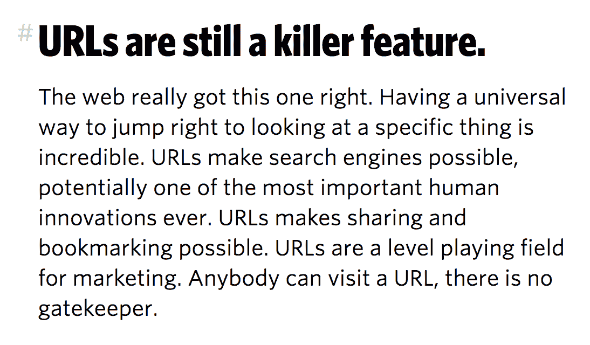
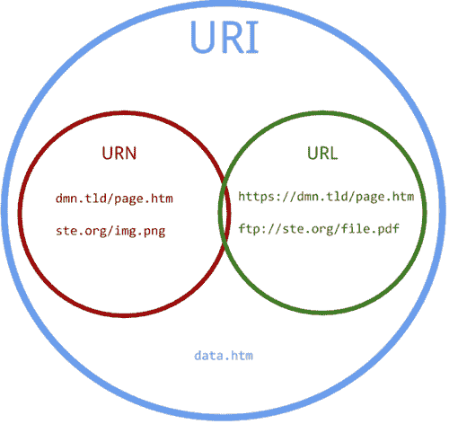
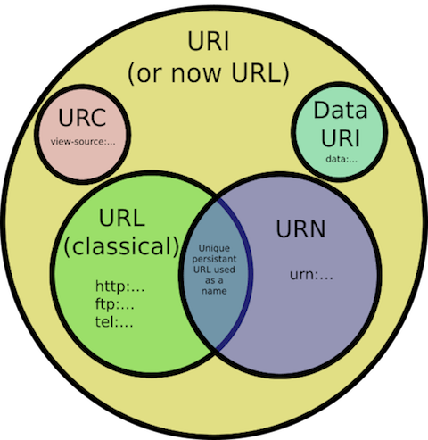
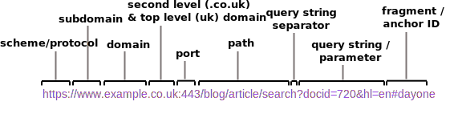

Welcome to my learning process. Today I tried learning about URLs.

**1: Sizzling Intro (Overconfidence)**

URLs are _still_ a killer feature of the Web. This is what [Chris Coyier](http://chriscoyier.net/) wrote recently on [CSS tricks](https://css-tricks.com/).

Cool!

So, URLs have stood the test of time on the Web, providing us from the very beginning with an unmanned gateway to information, ability to share things, and to _search_ (where would we be today without our trusty search engines?)

URLs seem simple. You type them in and voila. There can't be much to them, right?

**2: Lots of Confusion**

Wrong. I found these. _What do they mean?_

**3: Craving Different Perspectives**

I learn by researching the same topic written on by different people (_btw_ this is why you should blog). I found articles on URIs/URLs/URNs, e.g. [here](https://danielmiessler.com/study/url-uri/), [here](https://damnhandy.com/2009/08/26/url-vs-uri-vs-urn-in-more-concise-terms/) and [here](https://prateekvjoshi.com/2014/02/22/url-vs-uri-vs-urn/). I discovered lots of different, confusing terminology.

**4: Listening is Learning**

Desperate for some understanding, I watched two videos, [here](https://www.youtube.com/watch?v=vpYct2npKD8) and [here](https://www.youtube.com/watch?v=if0pzXWZOfY). I discovered simpler explanations and handy diagrams.

**5: Drawing Pretty Pictures**

I want to convey simply what a URL (and URI/URN) is. This inspired me to draw!

**6: **URL**y Like This**

This pic contains all parts of a URL I could find. Below are the (non-exhaustive) 1000 words it paints:

*   **Scheme/protocol** - Identifies a resource and tells you how to interpret the part of the URL after the colon. Mostly http/https/[ftp](https://en.wikipedia.org/wiki/File_Transfer_Protocol), but there are [lots](https://www.iana.org/assignments/uri-schemes/uri-schemes.xhtml) more.
*   **Subdomain** - The default is 'www'. Tim Berners-Lee admitted this should have been 'info'. TBL also admitted [this](http://www.telegraph.co.uk/technology/news/6321463/Sir-Tim-Berners-Lee-admits-forward-slashes-on-World-Wide-Web-were-a-mistake.html) mistake.
*   **Domain** - A nickname for an IP address (the string of numbers read by computers) that identifies Web pages.
*   **Second-level/top-level domain** - For 'example.com', example is the second-level domain and .com is the top-level domain.
*   **Port** - 443 is the default port for secure web servers (https). 80 is default for http. Web servers can listen on a port specified by a user and otherwise are usually hidden.
*   **Path** - The part of a URL that is [designed](http://warpspire.com/posts/url-design).
*   **Query string separator** - The '?' separates the query string from the other parts of the URL.
*   **Query string/parameter** - Set dynamically with an unstandardised structure, they commonly contain the the content of an HTML form. In the picture are 'docid' (document identifier) and 'hl' ( [host language](https://developers.google.com/custom-search/docs/xml_results?hl=en#WebSearch_Query_Parameter_Definitions)) with respective values of '720' and 'en'.
*   **Fragment/anchor ID** - Refers to an internal section within a web document.

*   **URI** - Uniform Resource Identifier. An entire set of directions for finding any sort of resource on the Web. Has two subsets - URLs and URNs.
*   **URL** - Uniform Resource Link. Identifies but also specifies **network location** of a resource. What most think of when imagining a link to a website, i.e. a Web address. **Absolute** URLs (i.e. including scheme) should link to external pages/images and a **relative** URLs should link to internal pages/images within your own site. [This](https://stackoverflow.com/questions/2005079/absolute-vs-relative-urls) helps avoid broken links when schemes or domain names change.
*   **URN** - Uniform Resource Name. Specifies **name** of resource. Useful because they are globally unique and persistent over long periods of time, even after the resource which they identify ceases to exist or becomes unavailable.

**6: Examples I Found**

**URN**

*   urn:isbn:0451450523 - The 1968 book The Last Unicorn, identified by its book number.
*   urn:lex:eu:council:directive:2010-03-09;2010-19-UE - A directive of the European Union, using the proposed Lex URN namespace.

**URL**

*   https://cascadingmedia.com/assets/images/insites/2015/02/url-anatomy/url-anatomy-55598c24.png
*   ftp://ftp.funet.fi/pub/standards/RFC/rfc959.txt

**URI**

*   http://example.com/resource?foo=bar#fragment (also a URL)
*   978-0553293357 - unique identifier for a book (also a URN)

**7: TL;DR**

*   A URI identifies a resource either by location, or a name, or both. A URI has two specializations known as URL and URN.
*   All URLs and URNs are URIs (see argument against this [here](https://stackoverflow.com/questions/176264/what-is-the-difference-between-a-uri-a-url-and-a-urn?rq=1)) but not all URIs are URLs and URNs.
*   Read my shorter, friendlier follow-up post on URLs.