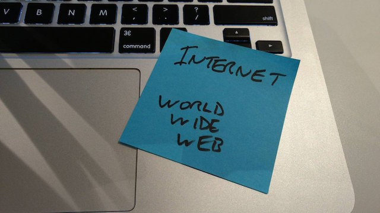

I was tasked by [Jeremy](https://adactio.com/) to explore the differences between the _Internet_ and _The World Wide Web_. At the start, I was hard pressed to explain them. All I knew is that the 'Web' was created by someone called [Tim Berners-Lee](https://en.wikipedia.org/wiki/Tim_Berners-Lee). I thought this meant he'd invented the entire Internet. I soon realised how wrong I was.

This [site](http://www.webopedia.com/DidYouKnow/Internet/Web_vs_Internet.asp) describes the differences in one sentence - "The Internet is a giant network connecting everyone's computers and it uses languages known as protocols to send information, and the Web is just one of these protocols". Simple, right? I went on to read that the Web is built 'on top of' the Internet. My confusion began. I knew I needed to get some background knowledge.

On Tim Berners-Lee's Wikipedia page were unfamiliar terms such as CERN, Hypertext, Transmission Control Protocol, etc. I deciphered that 'hypertext' is used to compile documents, 'hyperlinks' allow linking between such documents, and 'hypertext transfer protocol' (HTTP) is the internet protocol used to exchange or transfer hypertext. However, this didn't tell me about how the Internet and Web differ. This [video](https://youtu.be/j4cN_q3NX9c) describing Tim Berners-Lee's life, this Wikipedia [article](https://en.wikipedia.org/wiki/Web_browser) and Jeremy's [book](https://resilientwebdesign.com/) helped me figure out the following.

In short, in 1980, Tim worked for a company called CERN, the European Organization for Nuclear Research, and created a program called 'Enquire'. This let him easily manage information within the company by interlinking keywords in text documents. Such linking of textual information creates hypertext, and the links between them form hyperlinks. The hypertext transfer protocol communicates with the Internet to allow information transfer. This is the basis for the Web.

Long before this, the giant network known as the Internet (term coined in 1983) had already become an established part of many universities and scientific institutions. Functioning via physical connections that had already been laid for telegraphs and telephones, this decentralised network was robust in that it could still function even if parts of it failed.

The problem was that the Internet linked very different computer operating systems. Recalling knowledge from one to another required hefty expertise. In 1989, CERN wanted Tim back to help them with this issue. He created 'hypertext markup language' (HTML - based on CERN's 'standard generalised markup language' or SGML) and 'uniform resource locaters' (URLs). These allowed information to be accessed more readily.

The World Wide Web had been born. However, it only ran on the operating system used at CERN (NeXTSTEP), and the browser Tim created for it (the world's first) called 'World Wide Web' ran only on NEXT computers. Nicola Pellow saw to this problem by creating the 'Line Mode Browser' at CERN. Many browsers followed. These browsers could be installed on any computer, thus allowing anyone to use the Web.

* * *

I ended my research with this [lecture](https://www.youtube.com/watch?v=yF5-6AcohQw) by Tim Berners-Lee. It is his account of how the Web just 'happened', mixed with an enthusiastic account of the powerful personal and social reasons behind it. He explains how certain creations, e.g. a telephone, only work if other people use it as well. To build a sufficient network, you need early adopters, people with a 'gleam in their eye' as he puts it. He explains how everything that has been designed for use over the Internet or the Web is just like this and so can be deemed both technical and social. He goes on to explain how the Web took off:

"It's the psychology of people wanting to be read that makes them make links to other good things. And when they make links to other good things, by doing that, they are actually voting for those other good things. And the links themselves form this huge mass of critical review, which is actually how the web works. And the search engines aren't smart, they just use that massive critical review, put in by human beings. So, the search engines all rely on those links, critically. So, it's all about people. The system is a social, technical thing. The design of the technology and the design of the social piece - absolutely intimately linked."