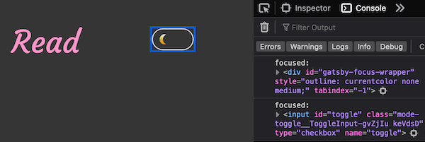
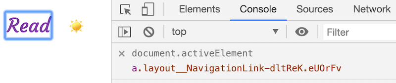
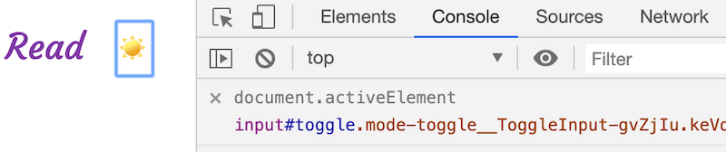

There was a bug in some of my code recently. A skip link was not working correctly. When it was focused and enter was pressed, focus was placed on the main content. Seemed okay. But, when tab was pressed to go into the main content, the focus went off to some place I could not see! I spent a few minutes trying to figure it out but could not. Then, I searched for how to programatically find focus. I found I could log `document.activeElement` into my console to do this.

You can log the document's active element in any browser console by placing a `console.log` into your JavaScript code. See the code block below for how to do this (thanks to <a href="https://twitter.com/GirlsCodeMK">my friend Eva</a>  for teaching me this):

```js
document.addEventListener('focusin', function() {
  console.log('focused: ', document.activeElement)
}, true);
```

Below is an image showing what such a log looks like in Firefox. It shows that the first element focused when I opened the page was a `div`. When I moved focus to the light/dark mode toggle, the focused element was an `input`:



In Chrome there is a live expression tool for logging the document's active element. The following two images show examples of this tool in action.




There are two things to note:
1. Ensuring focus is handled correctly is important for the accessibility of a web page. However, focus behaviour is not always consistent across browsers. If you're developing something and you are not sure whether focus is being handled correctly, it's a good idea to investigate by logging the document's active element.

2. If the element that is currently focused is removed from the DOM, the focus is moved either to the document's `body` element or becomes `null`.

Resources:
- <a href="https://hiddedevries.nl/en/blog/2019-01-30-console-logging-the-focused-element-as-it-changes">Console logging the focused element as it changes</a> (Hidde de Vries)
- <a href="https://zellwk.com/blog/inconsistent-button-behavior/">Inconsistent Button Behaviour</a>  (Zell Liew)
- <a href="https://developer.mozilla.org/en-US/docs/Web/API/DocumentOrShadowRoot/activeElement">Document or Shadow Root</a>  (MDN)