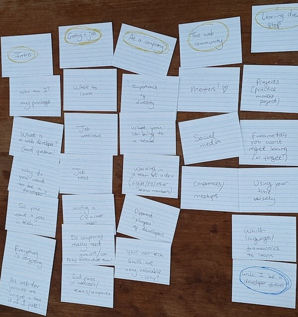

I'm writing a book for people who want to <strong>change careers and get into web development!</strong>

To get updates and sneak peeks please sign up below ❤️

<form action="https://app.kit.com/forms/8249481/subscriptions" class="seva-form formkit-form" method="post" data-sv-form="8249481" data-uid="5691deda41" data-format="inline" data-version="5" data-options="{&quot;settings&quot;:{&quot;after_subscribe&quot;:{&quot;action&quot;:&quot;message&quot;,&quot;success_message&quot;:&quot;Success! Now check your email to confirm your subscription.&quot;,&quot;redirect_url&quot;:&quot;&quot;},&quot;analytics&quot;:{&quot;google&quot;:null,&quot;fathom&quot;:null,&quot;facebook&quot;:null,&quot;segment&quot;:null,&quot;pinterest&quot;:null,&quot;sparkloop&quot;:null,&quot;googletagmanager&quot;:null},&quot;modal&quot;:{&quot;trigger&quot;:&quot;timer&quot;,&quot;scroll_percentage&quot;:null,&quot;timer&quot;:5,&quot;devices&quot;:&quot;all&quot;,&quot;show_once_every&quot;:15},&quot;powered_by&quot;:{&quot;show&quot;:true,&quot;url&quot;:&quot;https://kit.com/features/forms?utm_campaign=poweredby&amp;utm_content=form&amp;utm_medium=referral&amp;utm_source=dynamic&quot;},&quot;recaptcha&quot;:{&quot;enabled&quot;:false},&quot;return_visitor&quot;:{&quot;action&quot;:&quot;show&quot;,&quot;custom_content&quot;:&quot;&quot;},&quot;slide_in&quot;:{&quot;display_in&quot;:&quot;bottom_right&quot;,&quot;trigger&quot;:&quot;timer&quot;,&quot;scroll_percentage&quot;:null,&quot;timer&quot;:5,&quot;devices&quot;:&quot;all&quot;,&quot;show_once_every&quot;:15},&quot;sticky_bar&quot;:{&quot;display_in&quot;:&quot;top&quot;,&quot;trigger&quot;:&quot;timer&quot;,&quot;scroll_percentage&quot;:null,&quot;timer&quot;:5,&quot;devices&quot;:&quot;all&quot;,&quot;show_once_every&quot;:15}},&quot;version&quot;:&quot;5&quot;}" min-width="400 500 600 700 800">
<ul class="formkit-alert formkit-alert-error" data-element="errors" data-group="alert"></ul>

<label class="hidden" for="email">Email:</label><input class="formkit-input" id="email" name="email_address" style="color: rgb(0, 0, 0); border-color: rgb(227, 227, 227); border-radius: 4px; font-weight: 400;" aria-label="Email Address" placeholder="Email Address" required="" type="email">
<button data-element="submit" class="formkit-submit formkit-submit" style="color: rgb(255, 255, 255); background-color: rgb(22, 119, 190); border-radius: 4px; font-weight: 400;">

Subscribe</button>

</form>

To sign up as a [beta reader](https://en.wikipedia.org/wiki/Beta_reader) please send an email to <a href="mailto:switchtowebdev@gmail.com?subject=I'd like to help make Switch to Web Dev great!">switchtowebdev@gmail.com</a> ❤️

<section>

# Timeline

 

## October 2020

I opened Google Docs. Inside, I wrote down everything I could think of about switching careers to web development. I added a table of contents.

## April 2022

I bought and read "<a href="https://www.amazon.co.uk/gp/product/B00AB77M5S/ref=ppx_yo_dt_b_d_asin_title_o06">How to Write a Nonfiction eBook in 21 Days - That Readers LOVE!</a>" by Steve Scott. I opened my Google Doc and wrote down some useful pointers from the book.

## May 2022

I thought I better get on with my book, so I opened my Google Doc. I wrote an introduction and something about personal projects.

## June 2022

I used flashcards to organise a table of contents (which later changed almost completely).

## September 2022

I bought and read "<a href="https://www.amazon.co.uk/gp/product/B0983HFQX7/ref=ppx_yo_dt_b_d_asin_title_o00">Write Useful Books: A modern approach to designing and refining recommendable nonfiction</a>" by Rob Fitzpatrick. I opened my Google Doc and wrote down some useful pointers from the book. The book helped me realise the table of contents I had created needed improvement.

I bought and read two other career-switch-to-web books. These books helped me figure out what I did and didn't want in my book: "<a href="https://www.amazon.co.uk/How-Get-Job-Web-Development-ebook/dp/B07FBQXB5X/ref=sr_1_1">How to Get a Job in Web Development: The Ultimate Guide</a>" and "<a href="https://www.amazon.co.uk/gp/product/B079152S5T/ref=ppx_yo_dt_b_d_asin_title_o05">How to Become a Web Developer: The Career Changer's Guide</a>".

## March 2023

Now that my child is in daycare, I can dedicate a little more time to writing. I can also keep telling myself that a little bit of writing a day is better than none. Logic over fear, let's go!

My writing mantra is to cut the fluff and tell people exactly what they need, in plain language. Currently feeling thankful for the longer, fluffier paragraphs I wrote years ago. I can take those and cut them down!

    
<strong>Update email 1 (31.03.23)</strong>

<u>Progress</u>

I have begun to include a mix of personal stories and more factual information.

Even though I know I don't need to yet, I'm worrying about things like how to fit the personal stories around the facts, among other things like tone of voice.

I'm spending lots of time moving chunks of text around and deleting stuff.

I'm finding that I'm not very comfortable writing huge blocks of text without immediately editing them. Going back to the blocks the next day brings me fresh clarity that enables me to edit better!

<u>Sneak Peek</u>

None yet. Maybe next time ;)

<u>Inspiration</u>

I found a good post from [Leo Babauta](https://leobabauta.com/). He says to make writing easier, write for one person only. I'm writing for people who are in the position I was years ago. I'm writing for people who wish for a career change and are interested in becoming a web developer.

 

## April 2023

Chipping away at the book, paragraph by paragraph, night by night. The work feels slow. Like I am adding dominoes, one at a time, very, very gradually to a long and dusty, years-old line of old dominoes that stretches further than the eye can see. But, I feel good about it! I can't see or even <em>feel</em> the progress. Not really. But I know it is there. Once I wrote 100 words a day for 100 days and at the end had 10,000 words of material. Those few words I wrote every day felt so easy to write and grew into something huge. This is what's happening with my book as well.

I asked a good friend of mine if she'd share her experiences of becoming a developer with me. She said she'd be happy to support me ❤️

I asked on Mastodon [whether anyone knows a new web developer who used to do something else](https://indieweb.social/@ambrwlsn/110208988232303128). I am excited to chat with people!

## August 2024

Hello! I'm back! I've been writing. I have a few chapters set up.

I'm currently grappling with a question.

If I write this book in public, include real developer stories, and ask for review help from other developers, how do I market the finished book?

I don't want to sell the book as if it's my accomplishment alone. I don't want to profit off of it alone. That feels greedy.

My current idea is to put it up as a digital file via an indie seller website for around $5. This feels underpriced but would make it more accessible to more people and hopefully nod to all the people who supported me along the way.

## April 2025

Alright. Nearly 5 years after starting the book, I am serious about finishing it this time. This may be due to my three year old now sleeping at a consistent time every evening.

I am planning to interview at least two more people for the section on people's personal experiences switching careers to web dev.

A pile of good notes exists that will slowly be worked through.

The task ahead feels daunting. I need some writing inspiration! On that note, a big shout out to my pal Laura for giving me some [much-needed motivation](https://mastodon.social/@alicetragedy/114397613412671541).

## May 2025

<blockquote class="mastodon-embed" data-embed-url="https://indieweb.social/@ambrwlsn/114479425843980173/embed" style="background: #FCF8FF; border-radius: 8px; border: 1px solid #C9C4DA; margin: 0; max-width: 540px; min-width: 270px; overflow: hidden; padding: 0;"> <a href="https://indieweb.social/@ambrwlsn/114479425843980173" target="_blank" style="align-items: center; color: #1C1A25; display: flex; flex-direction: column; font-family: system-ui, -apple-system, BlinkMacSystemFont, 'Segoe UI', Oxygen, Ubuntu, Cantarell, 'Fira Sans', 'Droid Sans', 'Helvetica Neue', Roboto, sans-serif; font-size: 14px; justify-content: center; letter-spacing: 0.25px; line-height: 20px; padding: 24px; text-decoration: none;"> <svg xmlns="http://www.w3.org/2000/svg" xmlns:xlink="http://www.w3.org/1999/xlink" width="32" height="32" viewBox="0 0 79 75"><path d="M74.7135 16.6043C73.6199 8.54587 66.5351 2.19527 58.1366 0.964691C56.7196 0.756754 51.351 0 38.9148 0H38.822C26.3824 0 23.7135 0.756754 22.2966 0.964691C14.1319 2.16118 6.67571 7.86752 4.86669 16.0214C3.99657 20.0369 3.90371 24.4888 4.06535 28.5726C4.29578 34.4289 4.34049 40.275 4.877 46.1075C5.24791 49.9817 5.89495 53.8251 6.81328 57.6088C8.53288 64.5968 15.4938 70.4122 22.3138 72.7848C29.6155 75.259 37.468 75.6697 44.9919 73.971C45.8196 73.7801 46.6381 73.5586 47.4475 73.3063C49.2737 72.7302 51.4164 72.086 52.9915 70.9542C53.0131 70.9384 53.0308 70.9178 53.0433 70.8942C53.0558 70.8706 53.0628 70.8445 53.0637 70.8179V65.1661C53.0634 65.1412 53.0574 65.1167 53.0462 65.0944C53.035 65.0721 53.0189 65.0525 52.9992 65.0371C52.9794 65.0218 52.9564 65.011 52.9318 65.0056C52.9073 65.0002 52.8819 65.0003 52.8574 65.0059C48.0369 66.1472 43.0971 66.7193 38.141 66.7103C29.6118 66.7103 27.3178 62.6981 26.6609 61.0278C26.1329 59.5842 25.7976 58.0784 25.6636 56.5486C25.6622 56.5229 25.667 56.4973 25.6775 56.4738C25.688 56.4502 25.7039 56.4295 25.724 56.4132C25.7441 56.397 25.7678 56.3856 25.7931 56.3801C25.8185 56.3746 25.8448 56.3751 25.8699 56.3816C30.6101 57.5151 35.4693 58.0873 40.3455 58.086C41.5183 58.086 42.6876 58.086 43.8604 58.0553C48.7647 57.919 53.9339 57.6701 58.7591 56.7361C58.8794 56.7123 58.9998 56.6918 59.103 56.6611C66.7139 55.2124 73.9569 50.665 74.6929 39.1501C74.7204 38.6967 74.7892 34.4016 74.7892 33.9312C74.7926 32.3325 75.3085 22.5901 74.7135 16.6043ZM62.9996 45.3371H54.9966V25.9069C54.9966 21.8163 53.277 19.7302 49.7793 19.7302C45.9343 19.7302 44.0083 22.1981 44.0083 27.0727V37.7082H36.0534V27.0727C36.0534 22.1981 34.124 19.7302 30.279 19.7302C26.8019 19.7302 25.0651 21.8163 25.0617 25.9069V45.3371H17.0656V25.3172C17.0656 21.2266 18.1191 17.9769 20.2262 15.568C22.3998 13.1648 25.2509 11.9308 28.7898 11.9308C32.8859 11.9308 35.9812 13.492 38.0447 16.6111L40.036 19.9245L42.0308 16.6111C44.0943 13.492 47.1896 11.9308 51.2788 11.9308C54.8143 11.9308 57.6654 13.1648 59.8459 15.568C61.9529 17.9746 63.0065 21.2243 63.0065 25.3172L62.9996 45.3371Z" fill="currentColor"/></svg> 
Post by @ambrwlsn@indieweb.social
 
View on Mastodon
 </a> </blockquote>
 

</section>
